# Diagramme de Classes -- Version Mise a Jour

Ce diagramme inclut les nouveaux modeles ajoutes depuis la version initiale : **GroupOwnership** (suivi de propriete des groupes) et **UserProfile** (avatar utilisateur).

```mermaid
classDiagram
    class User {
        +int id
        +String username
        +String email
        +String password
        +bool is_staff
        +bool is_superuser
    }

    class UserProfile {
        +int id
        +ImageField avatar
    }

    class Group {
        +int id
        +String name
    }

    class GroupOwnership {
        +int id
        +DateTime created_at
    }

    class Document {
        +int id
        +String title
        +Text html
        +Text text
        +SearchVector search_tsv
        +int current_version_no
        +Binary qr_code_data
        +DateTime created_at
        +DateTime updated_at
        +get_qr_code_resolve_url() String
        +delete()
    }

    class DocumentVersion {
        +UUID id
        +int version_no
        +Text html
        +Text text
        +SearchVector search_tsv
        +Text change_note
        +Text hash
        +DateTime created_at
    }

    class Label {
        +UUID id
        +String name
    }

    class DocumentLabel {
        +int id
    }

    class Collection {
        +UUID id
        +String name
        +DateTime created_at
    }

    class DocumentCollection {
        +int id
    }

    class DocumentRelation {
        +UUID id
        +String type
    }

    class Attachment {
        +UUID id
        +int version_no
        +String media_type
        +String filename
        +Binary data
        +JSON metadata
        +DateTime created_at
    }

    class ACL {
        +UUID id
        +String subject_type
        +String subject_id
        +String role
        +DateTime expires_at
        +DateTime created_at
    }

    class ShareLink {
        +UUID id
        +String role
        +String token
        +DateTime expires_at
        +DateTime revoked_at
        +DateTime created_at
    }

    class QRLink {
        +UUID id
        +int version_no
        +String code
        +String sig
        +DateTime expires_at
        +bool active
        +DateTime created_at
    }

    class AuditLog {
        +UUID id
        +String action
        +int version_no
        +DateTime ts
        +String ip
        +String user_agent
        +JSON context
    }

    class Role {
        <<enumeration>>
        OWNER
        EDITOR
        VIEWER
    }

    class Action {
        <<enumeration>>
        VIEW
        EDIT
        SHARE
        EXPORT
    }

    class RelationType {
        <<enumeration>>
        RELATED
        REVISION_OF
        REFERENCES
    }

    User "1" --> "0..1" UserProfile : possede
    User "1" --> "*" Document : owns
    User "1" --> "*" DocumentVersion : authors
    User "*" <--> "*" Group : belongs to
    User "1" --> "*" GroupOwnership : cree
    Group "1" --> "0..1" GroupOwnership : appartient a
    Document "1" --> "*" DocumentVersion : has versions
    Document "1" --> "*" Attachment : has attachments
    Document "1" --> "*" ACL : has permissions
    Document "1" --> "*" ShareLink : has share links
    Document "1" --> "*" QRLink : has QR links
    Document "1" --> "*" AuditLog : logs
    Document "*" <--> "*" Label : tagged via DocumentLabel
    Document "*" <--> "*" Collection : organized via DocumentCollection
    DocumentLabel --> Document
    DocumentLabel --> Label
    DocumentCollection --> Document
    DocumentCollection --> Collection
    Collection "0..1" --> "*" Collection : parent-children
    Collection --> User : owned by
    DocumentRelation --> Document : from_document
    DocumentRelation --> Document : to_document
    ACL --> User : created_by
    ShareLink --> User : created_by
    QRLink --> User : created_by
    AuditLog --> User : actor_user
    AuditLog --> ShareLink : via share_link
    AuditLog --> QRLink : via qr_link
    ACL ..> Role : uses
    ShareLink ..> Role : uses
    AuditLog ..> Action : uses
    DocumentRelation ..> RelationType : uses

    note for GroupOwnership "Nouveau modele : suivi de\nla propriete des groupes\n(OneToOne avec Group)"
    note for UserProfile "Nouveau modele : profil\nutilisateur avec avatar\n(OneToOne avec User)"
    note for Document "qr_code_data : stockage binaire\nen base de donnees (Neon Cloud)\nau lieu de fichier sur disque"
```

## Changements par rapport a la version precedente

| Element | Modification |
|---------|-------------|
| `GroupOwnership` | Nouveau modele -- suivi de la propriete des groupes (OneToOne avec `auth.Group`) |
| `UserProfile` | Nouveau modele -- profil utilisateur avec avatar (OneToOne avec `auth.User`) |
| `Document.qr_code_data` | Remplace `Document.qr_code` (ImageField) par un champ `BinaryField` pour stockage en base de donnees |
| Relations Group | Ajout de la relation `Group` --> `GroupOwnership` --> `User` |
