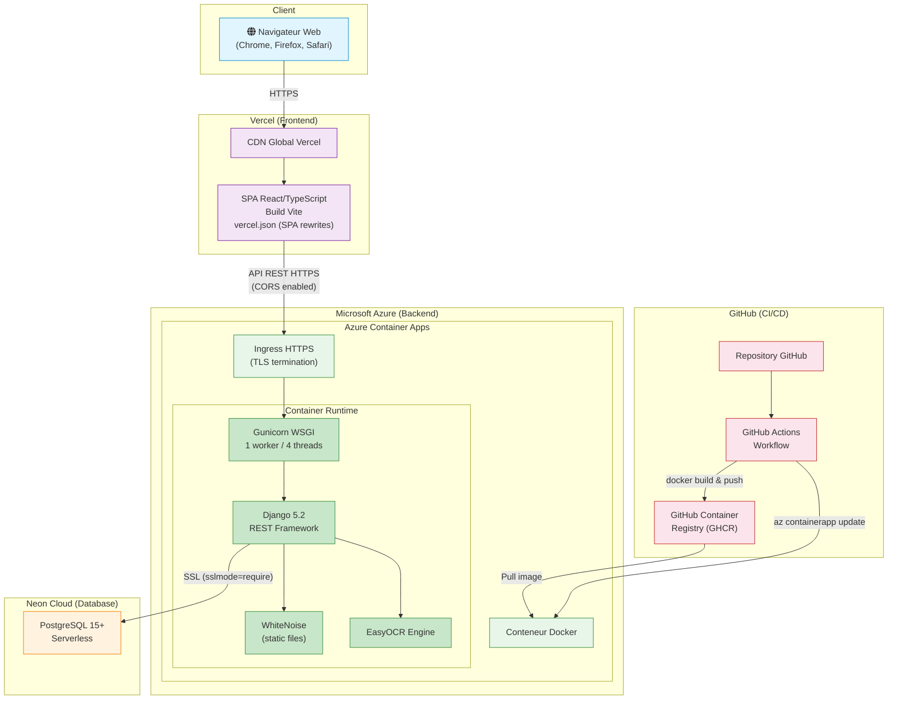
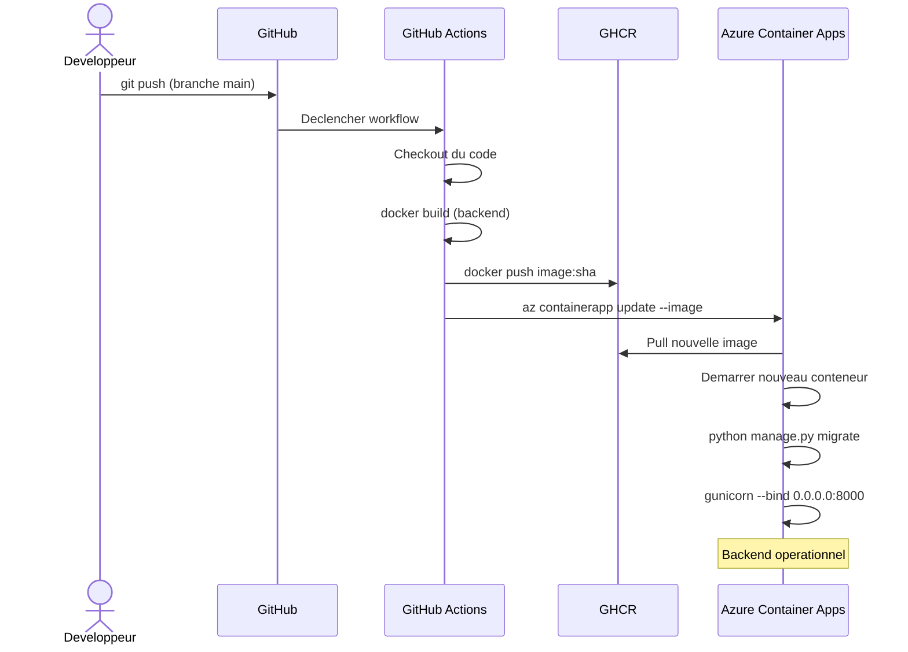

# Diagramme de Deploiement

Ce diagramme illustre l'architecture de deploiement de l'application en production.

## Description des composants

| Composant | Service Cloud | Role |
|-----------|--------------|------|
| Frontend SPA | **Vercel** | Hebergement du build React/Vite avec CDN global, deploiement automatique depuis la branche `main`, rewrites SPA pour le routage client-side |
| Backend API | **Azure Container Apps** | Execution du conteneur Docker avec Gunicorn, auto-scaling, terminaison TLS a l'ingress, variables d'environnement configurees |
| Base de donnees | **Neon Cloud** | PostgreSQL serverless avec connexion SSL, haute disponibilite, stockage des donnees applicatives et des avatars (base64) |
| Registry | **GitHub Container Registry** | Stockage des images Docker taguees par SHA de commit |
| CI/CD | **GitHub Actions** | Pipeline automatise : build de l'image Docker, push vers GHCR, deploiement sur Azure Container Apps |

## Flux de deploiement

## Variables d'environnement en production

| Variable | Service | Description |
|----------|---------|-------------|
| `DATABASE_URL` | Azure Container Apps | URL de connexion Neon PostgreSQL (avec sslmode=require) |
| `DJANGO_SECRET_KEY` | Azure Container Apps | Cle secrete Django pour la production |
| `ALLOWED_HOSTS` | Azure Container Apps | Domaines autorises (domaine Azure Container Apps) |
| `CORS_ALLOWED_ORIGINS` | Azure Container Apps | Origines CORS autorisees (https://stage-perf.vercel.app) |
| `CSRF_TRUSTED_ORIGINS` | Azure Container Apps | Origines CSRF de confiance |
| `VITE_API_URL` | Vercel | URL de l'API backend Azure |
