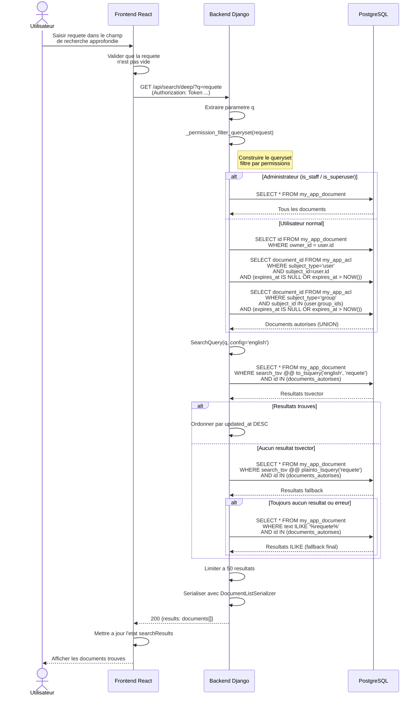
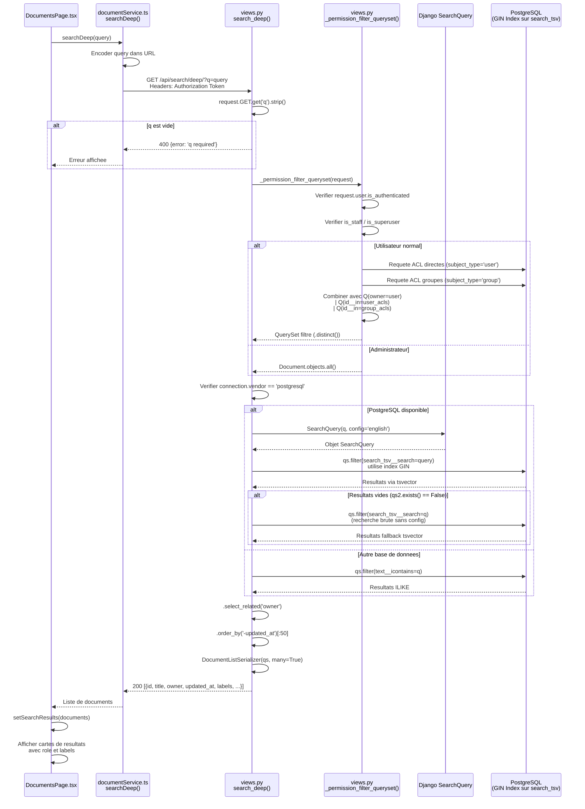
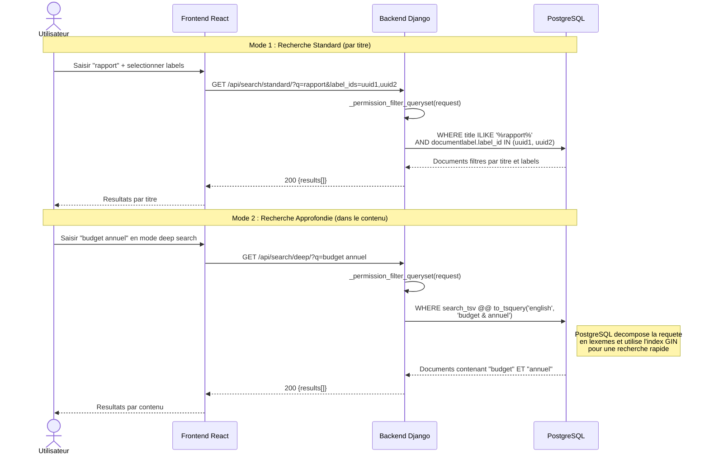

# Diagramme de Sequence : Recherche Approfondie (Deep Search)

## Sequence 1 : Recherche plein texte -- Vue systeme

## Sequence 2 : Recherche plein texte -- Vue detaillee (composants internes)

## Sequence 3 : Recherche standard vs recherche approfondie -- Comparaison

