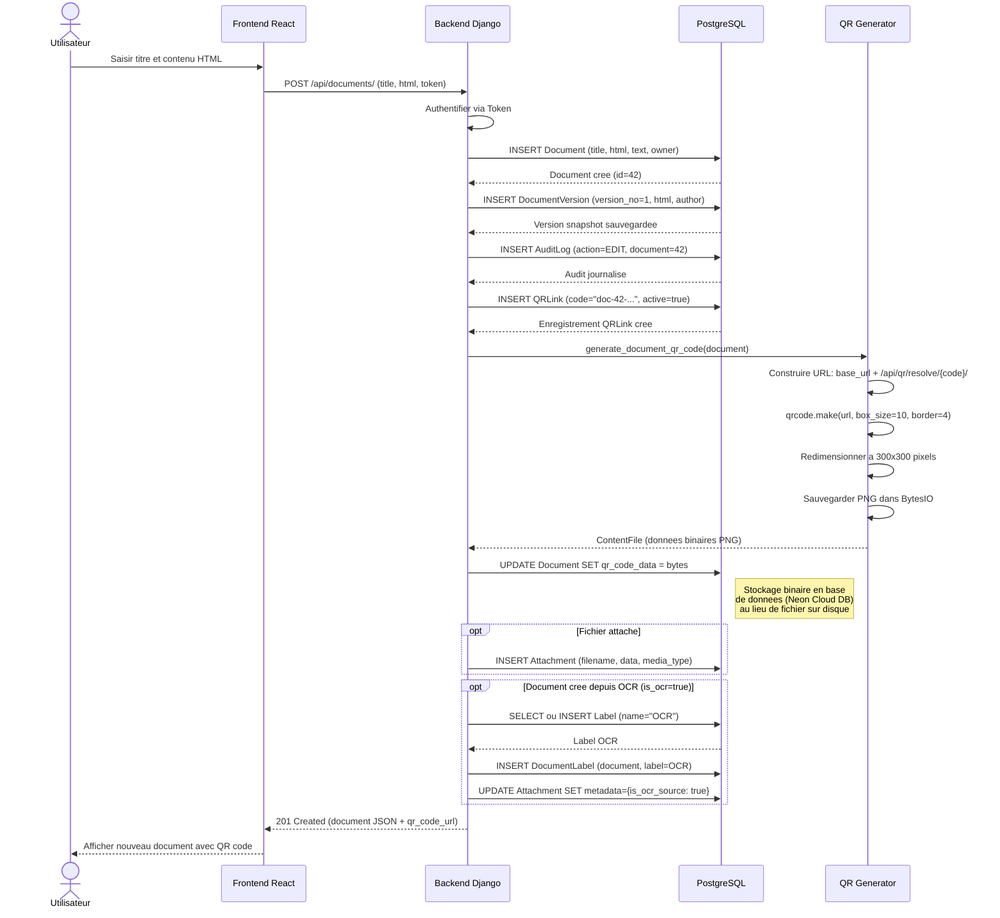
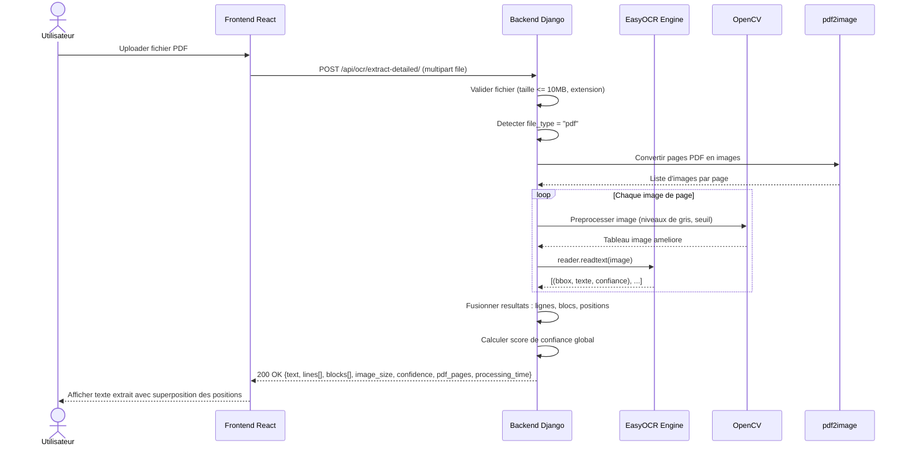
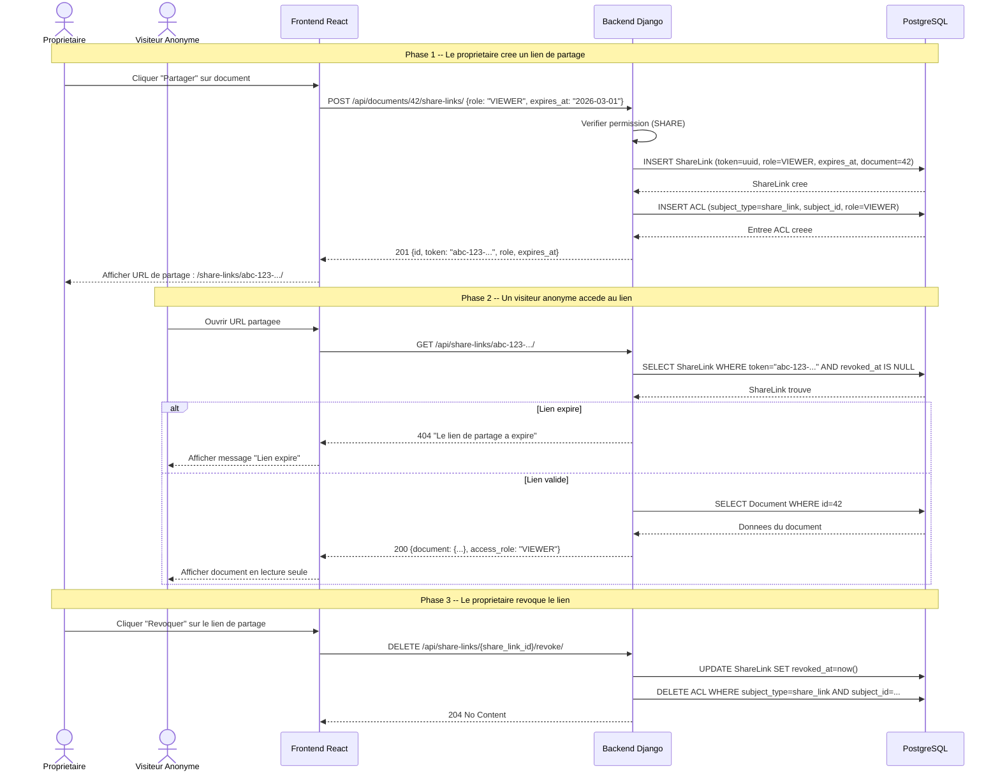
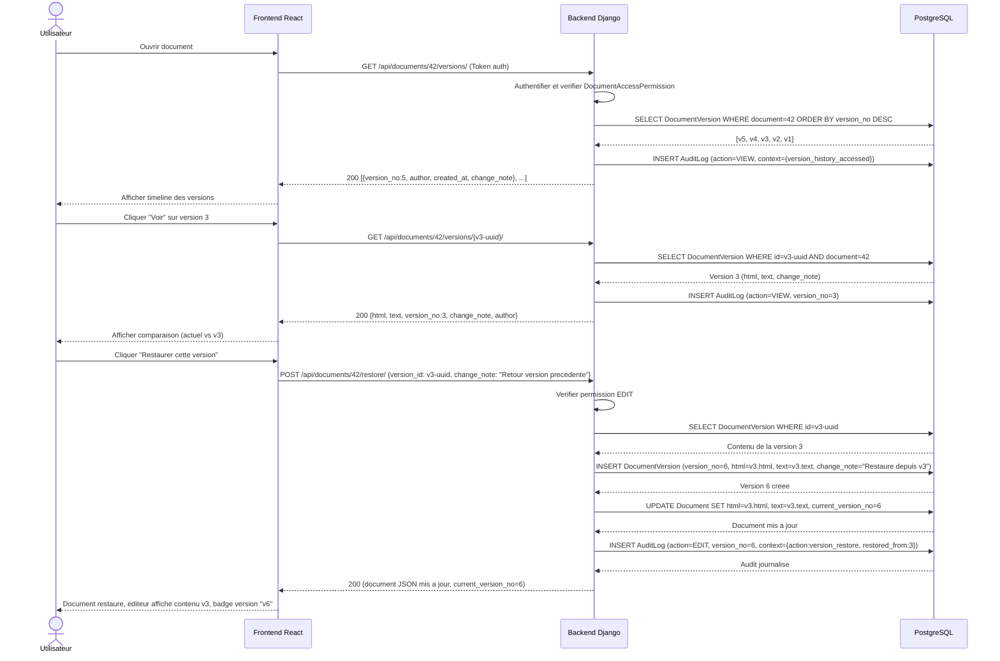
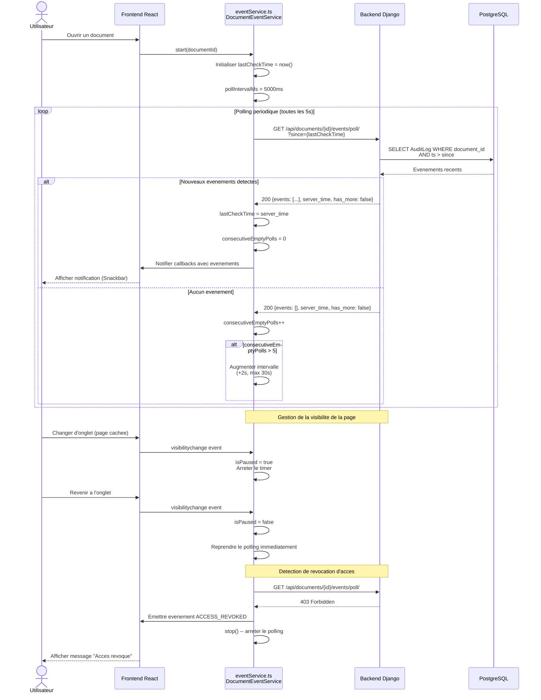
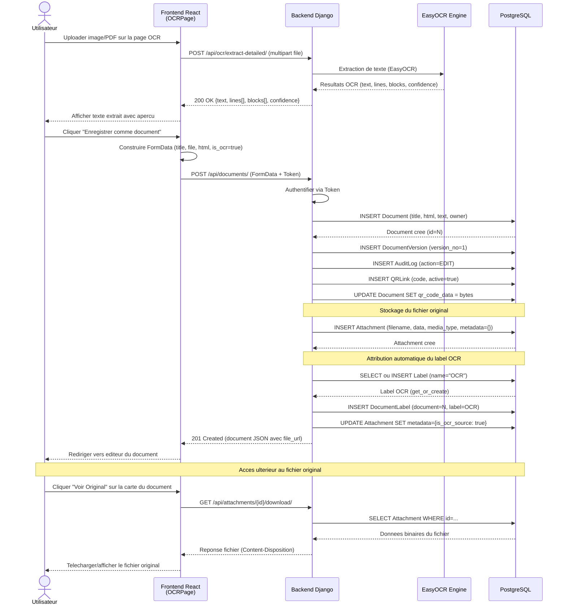

# Diagrammes de Sequence -- Version Mise a Jour

Ce fichier contient les diagrammes de sequence mis a jour pour refleter les changements recents du projet.

## Sequence 1 : Creation de document avec QR Code (Mise a jour)

> **Changement** : Le QR code est maintenant stocke en tant que donnees binaires dans la base de donnees PostgreSQL (champ `qr_code_data` de type `BinaryField`) au lieu d'un fichier image sur le disque.

## Sequence 2 : Extraction OCR depuis PDF (Inchange)

> Aucune modification -- le pipeline OCR reste identique.

## Sequence 3 : Partage de document via lien (Inchange)

> Aucune modification majeure.

## Sequence 4 : Restauration de version (Inchange)

> Aucune modification.

## Sequence 5 : Event Polling en temps reel (Nouveau)

> **Nouveau diagramme** : Mecanisme de polling pour les mises a jour en temps reel des documents.

## Sequence 6 : Creation de document depuis OCR (Nouveau)

> **Nouveau diagramme** : Flux complet de creation d'un document a partir d'un fichier scanne via OCR, avec stockage du fichier original et attribution automatique du label "OCR".

