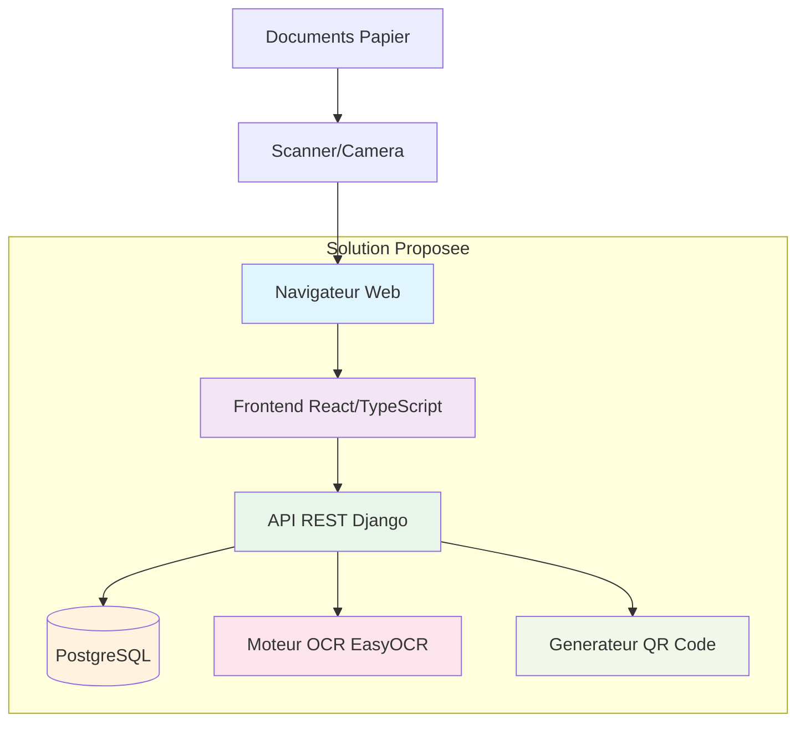
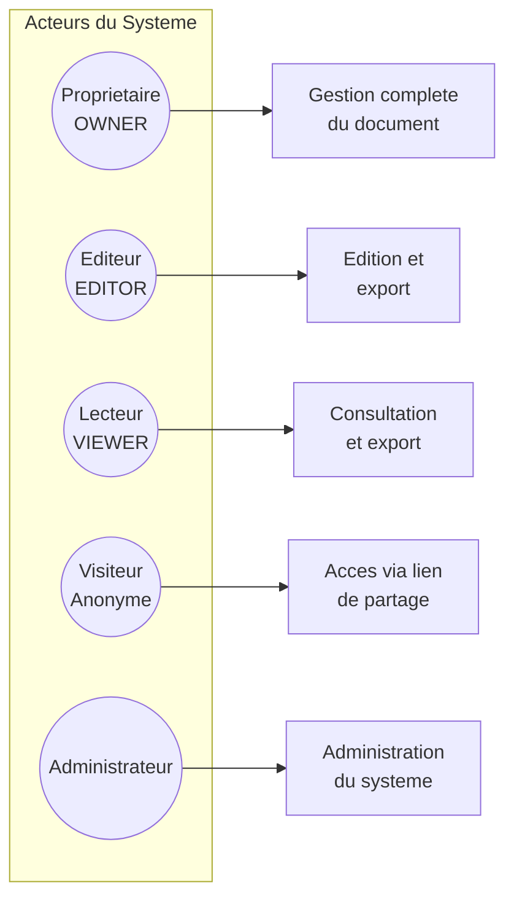
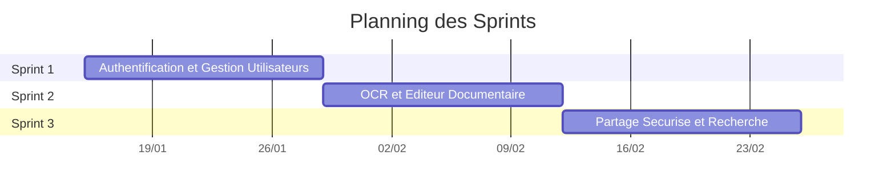

# Chapitre II : Etude Prealable

## 1. Etude de l'existant

### a. Description de la solution actuelleff

Avant la mise en place du present projet, la gestion documentaire au sein de l'organisme reposait sur des pratiques essentiellement manuelles et fragmentees. Les documents etaient stockes sous forme de fichiers physiques ou dans des repertoires partages sans structure normalisee. La digitalisation des documents papier se faisait de maniere ponctuelle, sans outil dedie d'OCR integre au flux de travail. Le partage de documents s'effectuait par courrier electronique ou via des supports amovibles, sans controle d'acces centralise ni tracabilite des consultations et modifications.

### b. Critique de l'existant

L'analyse de la situation existante revele plusieurs insuffisances :

| Probleme | Description |
|----------|-------------|
| Absence de digitalisation automatisee | Les documents papier ne sont pas numerises de facon systematique, ce qui entrave la recherche et l'exploitation des contenus. |
| Pas d'edition collaborative | Les utilisateurs travaillent sur des copies locales sans synchronisation ni gestion des conflits. |
| Controle d'acces inexistant | Tout utilisateur ayant acces au repertoire partage peut consulter et modifier n'importe quel document. |
| Aucune tracabilite | Les modifications ne sont pas journalisees, rendant impossible l'audit des actions. |
| Recherche limitee | La recherche se limite aux noms de fichiers, sans indexation du contenu. |
| Pas de versionnement | Les versions anterieures des documents sont perdues apres chaque modification. |

## 2. Solution proposee

La solution proposee est un **systeme de gestion documentaire full-stack** accessible via navigateur web. Cette application centralise l'ensemble du cycle de vie documentaire : digitalisation, edition, organisation, partage et recherche.

L'architecture repose sur une separation claire entre le frontend (interface utilisateur) et le backend (logique metier et persistance), communiquant via une API REST.

*Figure 1 : Vue d'ensemble de la solution proposee*

Les principaux modules de la solution sont :
- **Module d'authentification** : Inscription, connexion, gestion des tokens.
- **Module OCR** : Extraction de texte depuis images et PDF avec detection de la mise en page.
- **Module d'edition** : Editeur riche multi-pages avec export Word.
- **Module de versionnement** : Historique complet des modifications avec restauration.
- **Module de partage** : Controle d'acces par roles, liens de partage et QR codes.
- **Module de recherche** : Recherche plein texte avec PostgreSQL tsvector.
- **Module d'audit** : Journal complet des actions utilisateur.

## 3. Acteurs du systeme

Le systeme identifie les acteurs suivants :

*Figure 2 : Acteurs du systeme et leurs privileges*

- **Proprietaire (OWNER)** : Utilisateur ayant cree le document. Il dispose de tous les droits : consultation, modification, partage, export et suppression.
- **Editeur (EDITOR)** : Utilisateur autorise a consulter, modifier et exporter le document, sans pouvoir le partager ni le supprimer.
- **Lecteur (VIEWER)** : Utilisateur autorise uniquement a consulter et exporter le document.
- **Visiteur anonyme** : Personne accedant a un document via un lien de partage public (ShareLink) avec les permissions associees au lien.
- **Administrateur** : Utilisateur ayant acces a l'ensemble des documents et des fonctionnalites d'administration du systeme.

## 4. Besoins fonctionnels

Les besoins fonctionnels identifies pour le systeme sont les suivants :

| ID | Besoin fonctionnel | Priorite |
|----|-------------------|----------|
| BF01 | Inscription et connexion des utilisateurs | Haute |
| BF02 | Authentification par token (JWT) | Haute |
| BF03 | Creation, modification et suppression de documents | Haute |
| BF04 | Edition riche de type traitement de texte (multi-pages) | Haute |
| BF05 | Extraction de texte par OCR (images et PDF) | Haute |
| BF06 | Gestion des versions des documents | Moyenne |
| BF07 | Organisation par labels (etiquettes) | Moyenne |
| BF08 | Organisation par collections hierarchiques | Moyenne |
| BF09 | Controle d'acces par roles (OWNER, EDITOR, VIEWER) | Haute |
| BF10 | Partage de documents via liens avec tokens | Haute |
| BF11 | Generation et resolution de QR codes | Moyenne |
| BF12 | Recherche par titre avec filtrage par labels | Moyenne |
| BF13 | Recherche plein texte dans le contenu (tsvector) | Moyenne |
| BF14 | Export de documents au format Word (.docx) | Moyenne |
| BF15 | Journal d'audit des actions utilisateur | Haute |
| BF16 | Gestion des groupes d'utilisateurs | Moyenne |

## 5. Besoins non fonctionnels

| ID | Besoin non fonctionnel | Description |
|----|----------------------|-------------|
| BNF01 | Performance | Temps de reponse inferieur a 2 secondes pour les operations courantes. |
| BNF02 | Securite | Authentification par token, controle d'acces RBAC, protection CORS, protection CSRF. |
| BNF03 | Ergonomie | Interface intuitive et responsive, editeur de type Word familier aux utilisateurs. |
| BNF04 | Scalabilite | Architecture modulaire permettant l'ajout de nouvelles fonctionnalites. |
| BNF05 | Portabilite | Deploiement containerise avec Docker, compatible multi-environnement (developpement, production). |
| BNF06 | Maintenabilite | Separation frontend/backend, code structure en couches, API documentee (Swagger). |
| BNF07 | Disponibilite | Base de donnees PostgreSQL hebergee en cloud (Neon) assurant la persistance. |

## 6. Choix methodologique : Scrum

### a. Roles Scrum

Les roles Scrum ont ete definis comme suit :

- **Product Owner** : Responsable de la definition des besoins et de la priorisation du Product Backlog. Il valide les livrables a la fin de chaque sprint.
- **Scrum Master** : Facilitateur garant du respect du cadre Scrum. Il elimine les obstacles et anime les ceremonies.
- **Equipe de developpement** : Le stagiaire, responsable de la conception, du developpement et des tests de l'application.

### b. Product Backlog

Le Product Backlog a ete constitue a partir des besoins fonctionnels identifies. Chaque element a ete estime en points de complexite et priorise :

| ID | User Story | Estimation | Sprint |
|----|-----------|-----------|--------|
| US01 | En tant qu'utilisateur, je veux m'inscrire et me connecter pour acceder au systeme. | 5 | Sprint 1 |
| US02 | En tant qu'utilisateur, je veux que mes sessions soient securisees par token. | 3 | Sprint 1 |
| US03 | En tant que proprietaire, je veux definir les roles d'acces a mes documents. | 8 | Sprint 1 |
| US04 | En tant qu'administrateur, je veux consulter le journal d'audit. | 5 | Sprint 1 |
| US05 | En tant qu'utilisateur, je veux extraire du texte depuis une image ou un PDF par OCR. | 8 | Sprint 2 |
| US06 | En tant qu'utilisateur, je veux editer des documents avec un editeur riche multi-pages. | 13 | Sprint 2 |
| US07 | En tant qu'utilisateur, je veux exporter mes documents au format Word. | 5 | Sprint 2 |
| US08 | En tant qu'utilisateur, je veux gerer les versions de mes documents. | 8 | Sprint 2 |
| US09 | En tant qu'utilisateur, je veux organiser mes documents par labels et collections. | 5 | Sprint 2 |
| US10 | En tant qu'utilisateur, je veux partager un document via un lien avec token. | 5 | Sprint 3 |
| US11 | En tant qu'utilisateur, je veux generer un QR code pour acceder rapidement a un document. | 5 | Sprint 3 |
| US12 | En tant qu'utilisateur, je veux rechercher des documents par titre et contenu. | 8 | Sprint 3 |
| US13 | En tant qu'utilisateur, je veux une recherche avancee plein texte. | 5 | Sprint 3 |

### c. Planning des sprints

*Figure 3 : Planning des sprints (diagramme de Gantt)*

| Sprint | Duree | Objectif principal | User Stories |
|--------|-------|--------------------|-------------|
| Sprint 1 | 2 semaines | Authentification et gestion des utilisateurs | US01, US02, US03, US04 |
| Sprint 2 | 2 semaines | OCR et editeur documentaire | US05, US06, US07, US08, US09 |
| Sprint 3 | 2 semaines | Partage securise et recherche | US10, US11, US12, US13 |
