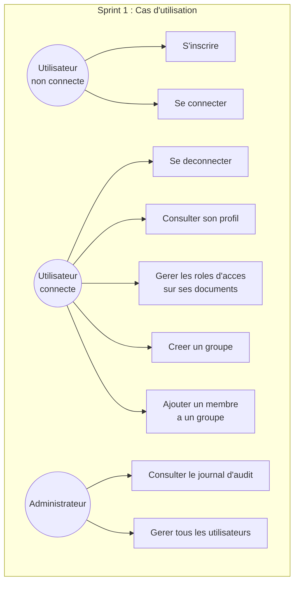
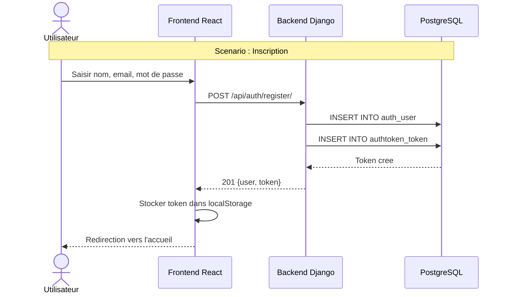
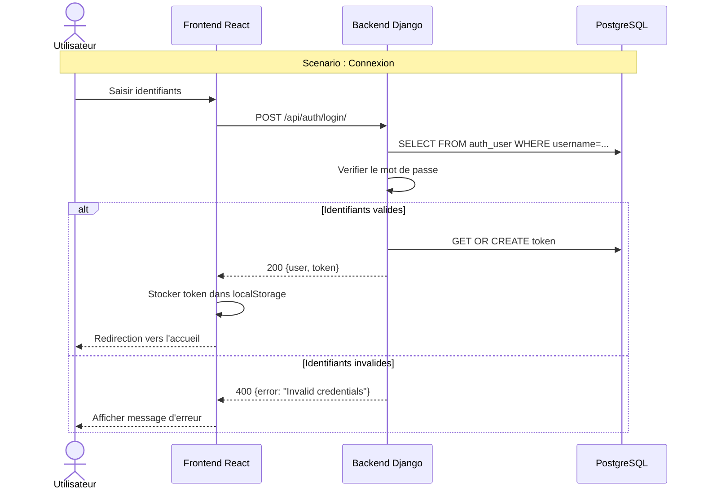
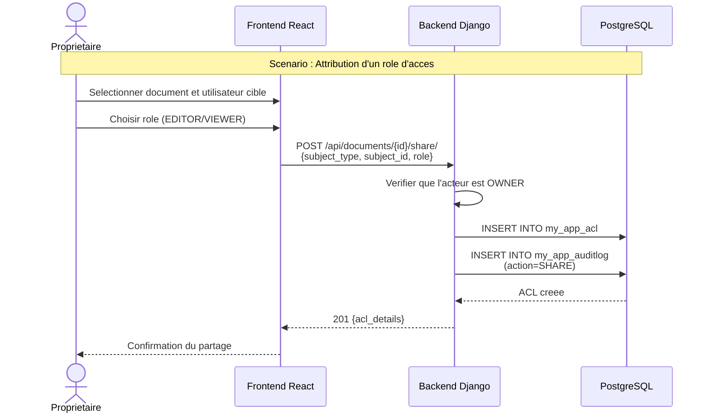
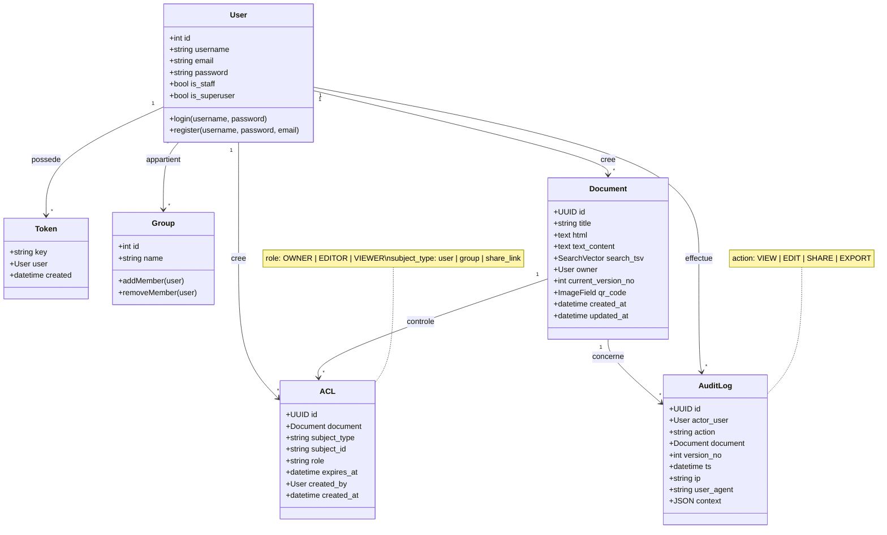
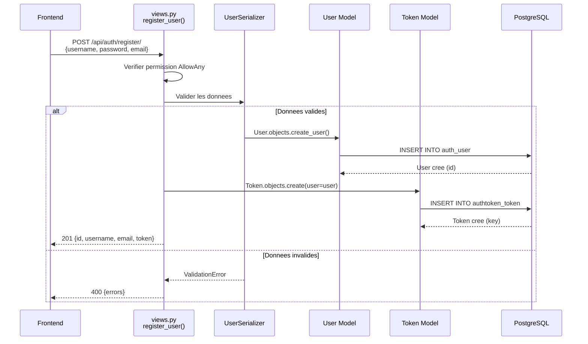
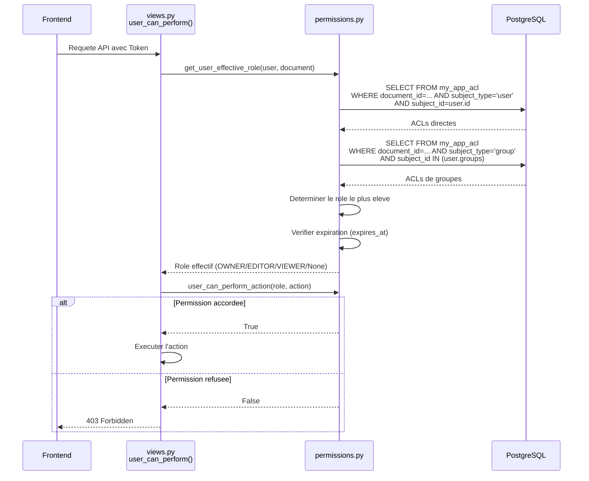

# Chapitre III : Sprint 1 -- Authentification et Gestion des Utilisateurs

## 1. Objectifs du sprint

Le premier sprint a pour objectif la mise en place du socle applicatif du systeme de gestion documentaire. Il couvre les fonctionnalites fondamentales suivantes :

- Inscription et connexion des utilisateurs avec authentification par token.
- Implementation du systeme de controle d'acces par roles (RBAC) avec trois niveaux : Proprietaire (OWNER), Editeur (EDITOR) et Lecteur (VIEWER).
- Mise en place du journal d'audit pour la tracabilite des actions.
- Configuration de l'architecture frontend/backend et de l'environnement de developpement.

## 2. Backlog du sprint

| ID | Tache | Estimation | Statut |
|----|-------|-----------|--------|
| T1.1 | Configuration du projet Django et PostgreSQL | 3 | Termine |
| T1.2 | Creation du modele User et des endpoints d'authentification | 5 | Termine |
| T1.3 | Implementation de l'authentification par token | 3 | Termine |
| T1.4 | Creation du modele ACL et du systeme RBAC | 8 | Termine |
| T1.5 | Implementation du modele AuditLog | 5 | Termine |
| T1.6 | Developpement de la page d'authentification (frontend) | 5 | Termine |
| T1.7 | Mise en place du routage et de la navigation | 3 | Termine |
| T1.8 | Tests et validation | 3 | Termine |

## 3. Specification des besoins

### a. Diagrammes de cas d'utilisation

*Figure 4 : Diagramme de cas d'utilisation -- Sprint 1*

**Description des cas d'utilisation principaux :**

**CU01 -- S'inscrire :**
- *Acteur* : Utilisateur non connecte
- *Precondition* : Aucune
- *Scenario principal* : L'utilisateur saisit un nom d'utilisateur, un mot de passe et une adresse e-mail. Le systeme cree le compte et retourne un token d'authentification.
- *Postcondition* : Le compte utilisateur est cree et le token est genere.

**CU02 -- Se connecter :**
- *Acteur* : Utilisateur non connecte
- *Precondition* : Le compte existe
- *Scenario principal* : L'utilisateur saisit ses identifiants. Le systeme verifie les credentials et retourne un token d'authentification.
- *Postcondition* : Le token est stocke dans le localStorage du navigateur.

**CU05 -- Gerer les roles d'acces :**
- *Acteur* : Utilisateur connecte (Proprietaire)
- *Precondition* : L'utilisateur est proprietaire du document
- *Scenario principal* : Le proprietaire selectionne un document, choisit un utilisateur ou un groupe, et attribue un role (EDITOR ou VIEWER) avec une date d'expiration optionnelle.
- *Postcondition* : L'entree ACL est creee et l'action est journalisee.

### b. Diagrammes de sequences systeme

*Figure 5 : Diagramme de sequence -- Inscription*

*Figure 6 : Diagramme de sequence -- Connexion*

*Figure 7 : Diagramme de sequence -- Attribution d'un role*

## 4. Conception

### a. Diagramme de classes

*Figure 8 : Diagramme de classes -- Sprint 1*

### b. Diagrammes de sequences detailles

*Figure 9 : Diagramme de sequence detaille -- Inscription*

*Figure 10 : Diagramme de sequence detaille -- Verification des permissions RBAC*

## 5. Realisation

### a. Environnement de travail

L'environnement de developpement mis en place pour le projet est le suivant :

**Outils de developpement :**

| Outil | Version | Utilisation |
|-------|---------|-------------|
| Visual Studio Code | Derniere version | Editeur de code principal |
| Python | 3.13 | Langage backend |
| Node.js | 18+ | Runtime frontend |
| Git | Derniere version | Gestion de versions du code |
| Docker Desktop | Derniere version | Conteneurisation |
| PostgreSQL | 15+ (Neon Cloud) | Base de donnees |
| Azure Container Apps | - | Hebergement backend (conteneur Docker) |
| Vercel | - | Hebergement frontend (SPA React) |
| GitHub Actions | - | CI/CD (build, test, deploiement) |

**Technologies backend :**

| Technologie | Version | Role |
|------------|---------|------|
| Django | 5.2.4 | Framework web Python |
| Django REST Framework | 3.15.2 | Construction de l'API REST |
| psycopg2 | 2.9.7+ | Adaptateur PostgreSQL |
| django-cors-headers | 4.3.1 | Gestion du CORS |
| python-dotenv | 1.0.0+ | Variables d'environnement |
| drf-yasg | 1.21.7 | Documentation Swagger/OpenAPI |
| Gunicorn | 21.0.0+ | Serveur WSGI (production) |
| WhiteNoise | 6.6.0+ | Fichiers statiques |

**Technologies frontend :**

| Technologie | Version | Role |
|------------|---------|------|
| React | 19.2.0 | Bibliotheque UI |
| TypeScript | 5.9.3 | Typage statique |
| Vite | 7.2.4 | Outil de build |
| React Router DOM | 7.7.1 | Routage client |
| ESLint | 9.39.1 | Qualite du code |

### b. Interfaces realisees

**Page d'authentification (AuthPage.tsx)** : Cette page presente deux formulaires -- l'un pour la connexion et l'autre pour l'inscription -- avec basculement entre les deux modes. Les champs requis sont le nom d'utilisateur, le mot de passe et l'adresse e-mail (pour l'inscription). Apres authentification reussie, le token est stocke dans le `localStorage` du navigateur et l'utilisateur est redirige vers la page d'accueil.

**Barre de navigation (App.tsx)** : La barre de navigation affiche le nom de l'utilisateur connecte ainsi qu'un bouton de deconnexion. Elle met en surbrillance la page active et offre un acces rapide a l'ensemble des modules du systeme : Editeur, OCR, Documents, Collections, Groupes, Gestion d'acces, Liens de partage, Historique des versions et Journal d'audit.

**Page de gestion d'acces (AccessManagementPage.tsx)** : Cette interface permet au proprietaire d'un document de gerer les permissions. Elle affiche la liste des ACL existantes avec le type de sujet (utilisateur ou groupe), le role attribue et la date d'expiration. Le proprietaire peut ajouter de nouvelles permissions ou revoquer des permissions existantes.

**Page des groupes (GroupsPage.tsx)** : Cette page permet de creer des groupes d'utilisateurs, d'ajouter ou de retirer des membres. Les groupes peuvent ensuite etre utilises dans le systeme ACL pour accorder des permissions a un ensemble d'utilisateurs.

## 6. Tests et validation

Les tests effectues durant ce sprint couvrent les scenarios suivants :

| Test | Description                                    | Resultat                                                          |
| ---- | ---------------------------------------------- | ----------------------------------------------------------------- |
| T1   | Inscription avec des donnees valides           | Le compte est cree et un token est retourne.                      |
| T2   | Inscription avec un nom d'utilisateur existant | Une erreur 400 est retournee avec un message explicite.           |
| T3   | Connexion avec des identifiants valides        | Le token est retourne et l'utilisateur est redirige.              |
| T4   | Connexion avec des identifiants invalides      | Une erreur 400 est retournee.                                     |
| T5   | Acces a une ressource protegee sans token      | Une erreur 401 est retournee.                                     |
| T6   | Attribution d'un role EDITOR a un utilisateur  | L'ACL est creee et l'action est journalisee.                      |
| T7   | Tentative de modification par un VIEWER        | Une erreur 403 est retournee.                                     |
| T8   | Verification de l'expiration d'un ACL          | L'acces est refuse apres la date d'expiration.                    |
| T9   | Consultation du journal d'audit                | Les actions sont correctement enregistrees avec IP et User-Agent. |

## 7. Revue de sprint

**Livrables du Sprint 1 :**
- Systeme d'authentification fonctionnel avec inscription, connexion et deconnexion.
- Authentification par token integree a toutes les requetes API.
- Systeme RBAC complet avec trois niveaux de roles et support des groupes.
- Journal d'audit operationnel enregistrant les actions, l'IP et le User-Agent.
- Interface d'authentification et de gestion des acces.
- Documentation API Swagger accessible a l'adresse `/swagger/`.

**Points positifs :**
- L'architecture backend est solide et extensible.
- Le systeme RBAC gere correctement les permissions directes et les permissions de groupe.
- Le journal d'audit capture toutes les informations necessaires a la tracabilite.

**Points d'amelioration :**
- L'integration de JWT avec refresh tokens pourrait remplacer les tokens simples pour une meilleure securite.
- Les tests unitaires automatises devraient etre ajoutes dans les sprints suivants.
