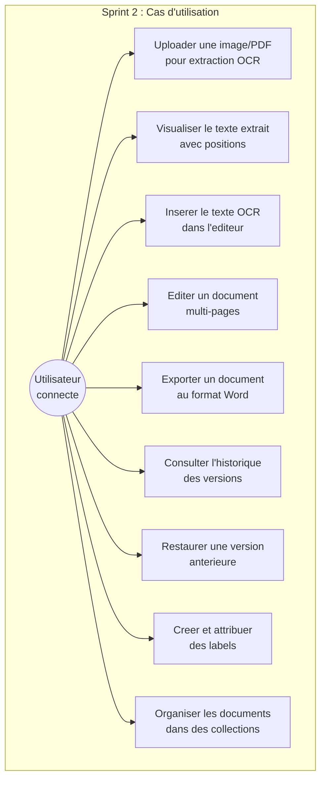
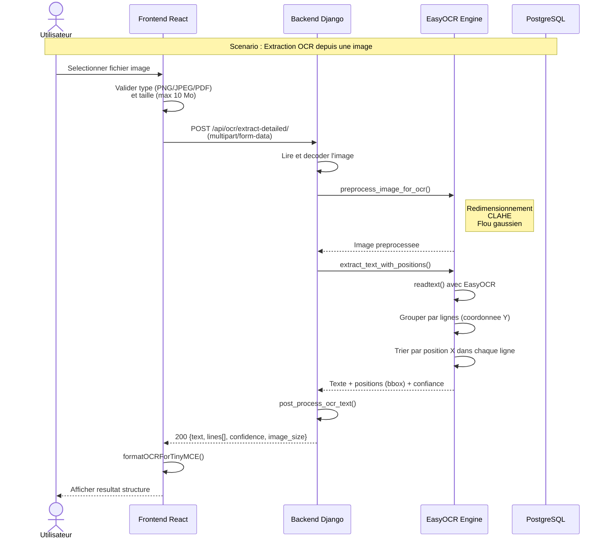
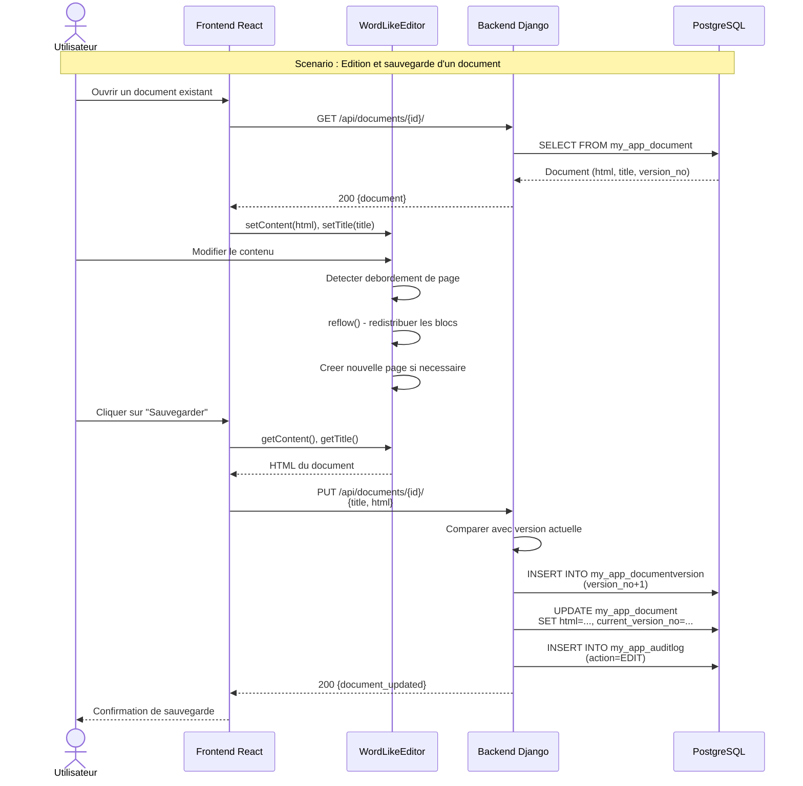
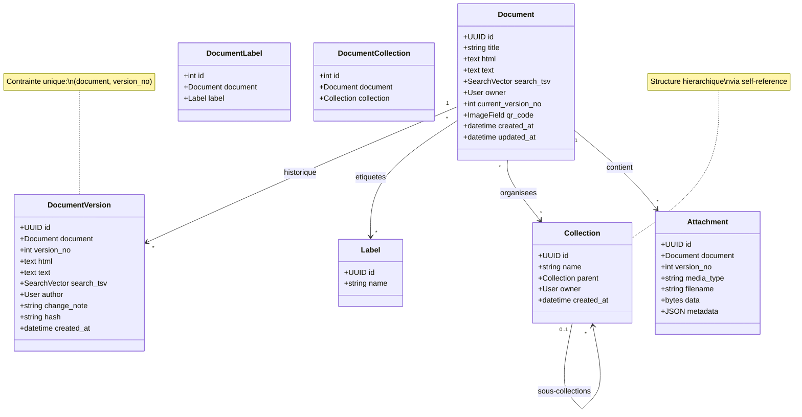
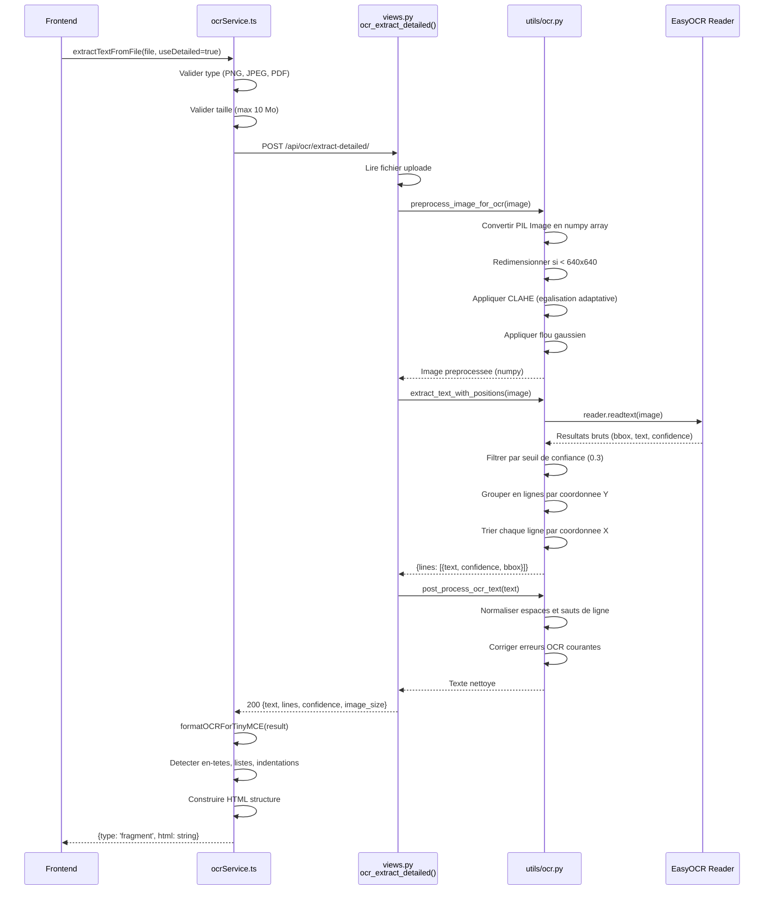
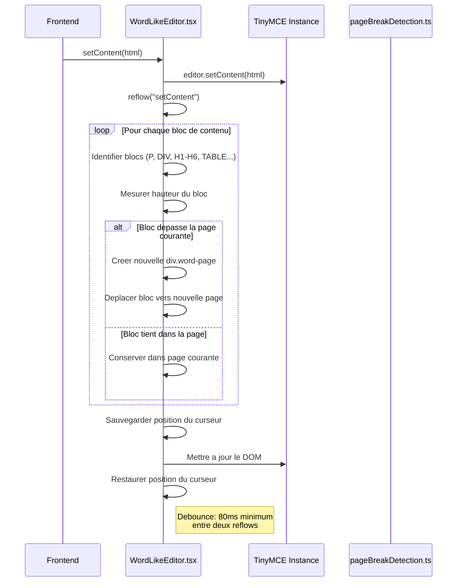

# Chapitre IV : Sprint 2 -- OCR et Editeur Documentaire

## 1. Objectifs du sprint

Le deuxieme sprint porte sur le coeur fonctionnel du systeme de gestion documentaire. Il couvre les fonctionnalites suivantes :

- Integration du moteur OCR EasyOCR pour l'extraction de texte a partir d'images et de fichiers PDF.
- Developpement d'un editeur de documents riche multi-pages de type traitement de texte (base sur TinyMCE).
- Export des documents au format Word (.docx).
- Implementation du systeme de versionnement des documents.
- Mise en place de l'organisation par labels (etiquettes) et collections hierarchiques.

## 2. Backlog du sprint

| ID | Tache | Estimation | Statut |
|----|-------|-----------|--------|
| T2.1 | Integration du moteur EasyOCR avec preprocessing d'images | 8 | Termine |
| T2.2 | Endpoint d'extraction OCR basique | 3 | Termine |
| T2.3 | Endpoint d'extraction OCR detaillee (positions) | 5 | Termine |
| T2.4 | Extraction OCR depuis PDF (multi-pages) | 5 | Termine |
| T2.5 | Developpement de l'editeur WordLikeEditor (TinyMCE) | 13 | Termine |
| T2.6 | Gestion multi-pages avec sauts de page dynamiques | 8 | Termine |
| T2.7 | Export au format Word (.docx) | 5 | Termine |
| T2.8 | Implementation du modele DocumentVersion | 5 | Termine |
| T2.9 | Endpoints de versionnement et restauration | 5 | Termine |
| T2.10 | Modeles et endpoints pour labels et collections | 5 | Termine |
| T2.11 | Interface OCR frontend | 5 | Termine |
| T2.12 | Interface de gestion des labels et collections | 3 | Termine |

## 3. Specification des besoins

### a. Diagrammes de cas d'utilisation

*Figure 11 : Diagramme de cas d'utilisation -- Sprint 2*

**CU -- Uploader une image pour OCR :**
- *Acteur* : Utilisateur connecte
- *Precondition* : Fichier de type PNG, JPEG ou PDF, taille maximale 10 Mo
- *Scenario principal* : L'utilisateur selectionne un fichier. Le systeme effectue le preprocessing de l'image (redimensionnement, egalisation d'histogramme, flou gaussien), puis extrait le texte avec positionnement. Le resultat est affiche avec le taux de confiance.
- *Postcondition* : Le texte extrait est disponible pour insertion dans l'editeur.

**CU -- Editer un document multi-pages :**
- *Acteur* : Utilisateur connecte (OWNER ou EDITOR)
- *Scenario principal* : L'utilisateur ouvre un document dans l'editeur. L'editeur affiche le contenu en pages distinctes simulant un document Word. L'utilisateur modifie le contenu ; les sauts de page se recalculent dynamiquement.
- *Postcondition* : Le document est sauvegarde et une nouvelle version est creee.

### b. Diagrammes de sequences systeme

*Figure 12 : Diagramme de sequence -- Extraction OCR*

*Figure 13 : Diagramme de sequence -- Edition et sauvegarde*

## 4. Conception

### a. Diagramme de classes

*Figure 14 : Diagramme de classes -- Sprint 2*

### b. Diagrammes de sequences detailles

*Figure 15 : Diagramme de sequence detaille -- Pipeline OCR complet*

*Figure 16 : Diagramme de sequence detaille -- Reflow de l'editeur multi-pages*

## 5. Realisation

### a. Environnement de travail

En complement de l'environnement decrit au Sprint 1, les technologies suivantes ont ete ajoutees :

**Technologies OCR :**

| Technologie | Version | Role |
|------------|---------|------|
| EasyOCR | 1.7.0+ | Moteur de reconnaissance optique de caracteres |
| PyTorch | 2.0.0+ | Framework de deep learning (utilise par EasyOCR) |
| OpenCV (cv2) | 4.8.0+ | Traitement et preprocessing d'images |
| Pillow (PIL) | 10.0.0+ | Manipulation d'images |
| NumPy | 1.26.0+ | Operations matricielles |
| pdf2image | 1.17.0+ | Conversion PDF vers images (utilise Poppler) |

**Technologies editeur :**

| Technologie | Version | Role |
|------------|---------|------|
| TinyMCE | Self-hosted | Editeur WYSIWYG riche |
| docx.js | 9.5.1 | Generation de fichiers Word (.docx) |
| file-saver | 2.0.5 | Telechargement de fichiers cote client |

### b. Interfaces realisees

**Page OCR (OCRPage.tsx)** : Cette page permet a l'utilisateur de telecharger un fichier image (PNG, JPEG) ou PDF pour en extraire le texte. L'interface affiche une zone de glisser-deposer pour le fichier, un indicateur de progression pendant le traitement, puis le resultat structure avec le taux de confiance global. L'utilisateur peut choisir d'inserer le texte extrait directement dans l'editeur de documents.

**Editeur de documents (WordLikeEditor.tsx)** : Le composant central de l'application est un editeur riche multi-pages construit autour de TinyMCE. Il simule l'experience d'un traitement de texte classique avec :
- Des pages distinctes separees visuellement (div.word-page).
- Un reflow automatique du contenu lorsque celui-ci depasse les limites d'une page.
- La detection et la gestion des elements de type bloc (paragraphes, titres H1-H6, tableaux, listes, images).
- La preservation de la position du curseur lors des reflows du DOM.
- Un debounce de 80 millisecondes pour eviter les reflows excessifs.

L'editeur expose une API via `React.forwardRef` comprenant les methodes : `getEditor()`, `getContent()`, `setContent()`, `getTitle()`, `setTitle()`, `insertContent()`, `focus()` et `reflow()`.

**Page de l'editeur de documents (DocumentEditorPage.tsx)** : Cette page integre le composant WordLikeEditor et fournit les boutons de sauvegarde et d'export. Elle charge le document existant via l'API et gere la sauvegarde avec creation automatique de version.

**Page d'historique des versions (VersionHistoryPage.tsx)** : Cette interface affiche la liste des versions d'un document avec le numero de version, l'auteur, la note de modification et la date. L'utilisateur peut consulter le contenu d'une version et restaurer une version anterieure.

**Page de gestion des collections (CollectionsManagerPage.tsx)** : Cette page permet de creer des collections (eventuellement hierarchiques en specifiant un parent), de supprimer des collections et d'assigner des documents a des collections.

## 6. Tests et validation

| Test | Description | Resultat |
|------|-------------|----------|
| T1 | Extraction OCR d'une image PNG contenant du texte | Texte extrait avec confiance > 80%. |
| T2 | Extraction OCR d'un fichier PDF multi-pages | Chaque page est traitee individuellement avec les positions. |
| T3 | Rejet d'un fichier depassant 10 Mo | Erreur 400 avec message explicite. |
| T4 | Rejet d'un format de fichier non supporte | Erreur de validation cote client. |
| T5 | Edition d'un document avec reflow multi-pages | Les pages se redistribuent correctement. |
| T6 | Sauvegarde et creation automatique de version | La version est incrementee et l'ancienne version est conservee. |
| T7 | Restauration d'une version anterieure | Le contenu est restaure et une nouvelle version est creee. |
| T8 | Export au format Word (.docx) | Le fichier genere s'ouvre correctement dans Microsoft Word. |
| T9 | Creation et attribution de labels | Les labels sont correctement associes au document. |
| T10 | Organisation en collections hierarchiques | Les collections parent-enfant fonctionnent correctement. |

## 7. Revue de sprint

**Livrables du Sprint 2 :**
- Pipeline OCR complet avec preprocessing d'images (CLAHE, flou gaussien, redimensionnement).
- Extraction OCR avec detection de positions (bounding boxes) et groupement intelligent en lignes.
- Support PDF multi-pages avec conversion page par page.
- Editeur multi-pages de type Word avec reflow dynamique et preservation du curseur.
- Export au format Word (.docx) via la bibliotheque docx.js.
- Systeme de versionnement complet avec historique et restauration.
- Organisation par labels et collections hierarchiques.

**Points positifs :**
- Le pipeline OCR produit des resultats de bonne qualite grace au preprocessing avance.
- L'editeur multi-pages offre une experience utilisateur proche d'un traitement de texte natif.
- Le systeme de versionnement assure la preservation de l'historique des modifications.

**Points d'amelioration :**
- Le support de langues supplementaires pour l'OCR (arabe, francais) pourrait etre ajoute.
- La performance du reflow pourrait etre optimisee pour les documents tres longs.
- L'ajout d'un mode collaboratif en temps reel constituerait une evolution interessante.
