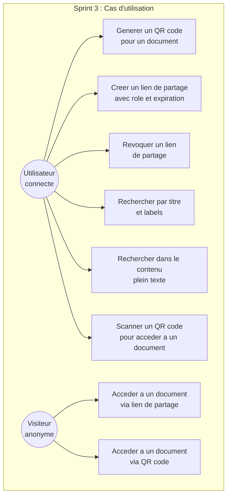
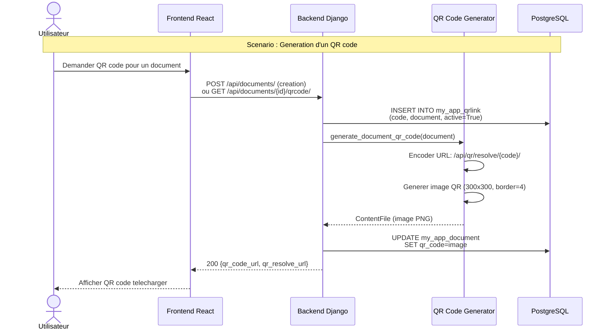
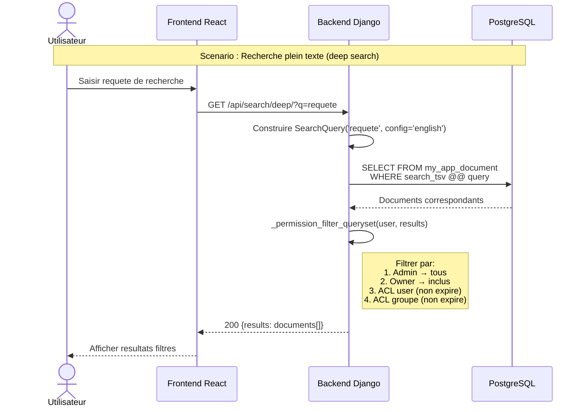
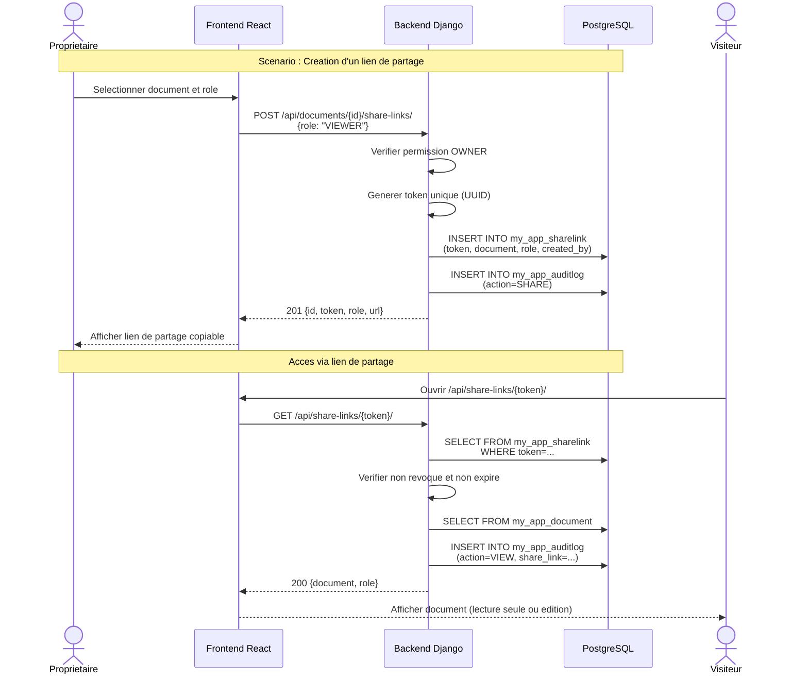
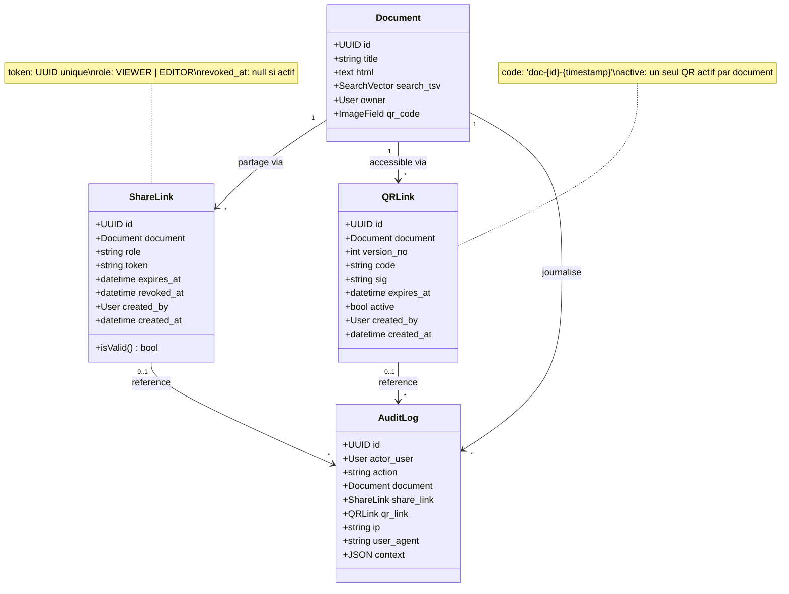
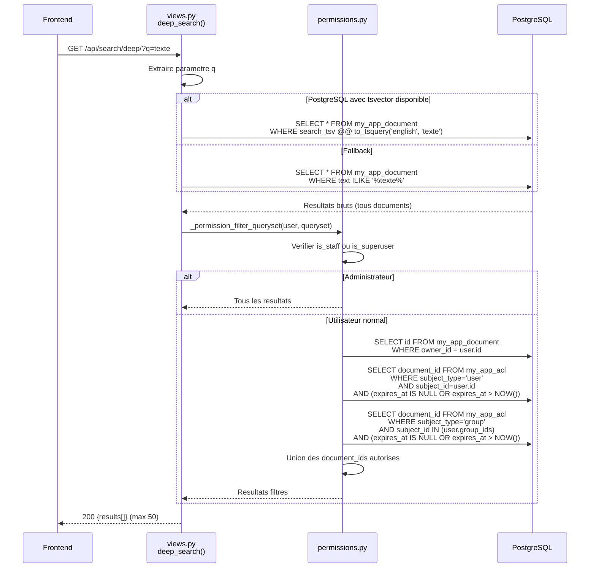
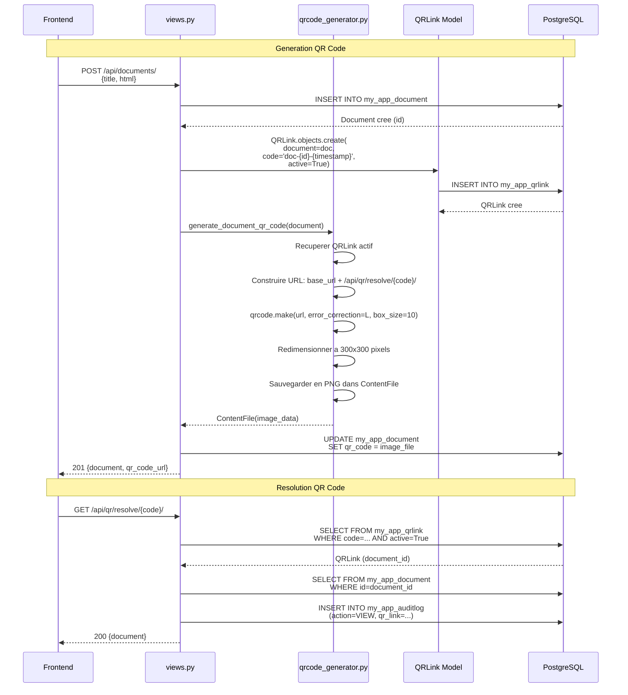

# Chapitre V : Sprint 3 -- Partage Securise et Recherche

## 1. Objectifs du sprint

Le troisieme sprint finalise le systeme de gestion documentaire en ajoutant les fonctionnalites de partage et de recherche :

- Generation de QR codes associes aux documents pour un acces rapide.
- Creation de liens de partage (ShareLink) avec tokens securises et roles configurables.
- Implementation de la recherche standard par titre avec filtrage par labels.
- Implementation de la recherche plein texte (deep search) exploitant les capacites PostgreSQL tsvector.
- Developpement de l'interface de recherche avancee.

## 2. Backlog du sprint

| ID | Tache | Estimation | Statut |
|----|-------|-----------|--------|
| T3.1 | Implementation du generateur de QR codes | 5 | Termine |
| T3.2 | Endpoint de resolution de QR codes | 3 | Termine |
| T3.3 | Modele QRLink et gestion d'expiration | 3 | Termine |
| T3.4 | Modele ShareLink et generation de tokens | 5 | Termine |
| T3.5 | Endpoints de partage par lien | 5 | Termine |
| T3.6 | Recherche standard par titre avec filtrage | 3 | Termine |
| T3.7 | Recherche plein texte avec PostgreSQL tsvector | 8 | Termine |
| T3.8 | Filtrage des resultats par permissions | 5 | Termine |
| T3.9 | Interface de partage et QR codes (frontend) | 5 | Termine |
| T3.10 | Interface de recherche avancee (frontend) | 3 | Termine |
| T3.11 | Tests et validation | 3 | Termine |

## 3. Specification des besoins

### a. Diagrammes de cas d'utilisation

*Figure 17 : Diagramme de cas d'utilisation -- Sprint 3*

**CU -- Creer un lien de partage :**
- *Acteur* : Utilisateur connecte (Proprietaire)
- *Precondition* : L'utilisateur est proprietaire du document
- *Scenario principal* : Le proprietaire selectionne un document, choisit le role a accorder (VIEWER ou EDITOR), et optionnellement definit une date d'expiration. Le systeme genere un token unique et retourne l'URL de partage.
- *Postcondition* : Le ShareLink est cree et l'action est journalisee dans l'audit.

**CU -- Recherche plein texte :**
- *Acteur* : Utilisateur connecte
- *Scenario principal* : L'utilisateur saisit une requete de recherche. Le systeme interroge l'index tsvector de PostgreSQL pour trouver les documents dont le contenu correspond a la requete, filtre les resultats selon les permissions de l'utilisateur, et retourne les documents accessibles.
- *Postcondition* : Les resultats sont affiches, limites aux documents autorises.

### b. Diagrammes de sequences systeme

*Figure 18 : Diagramme de sequence -- Generation de QR code*

*Figure 19 : Diagramme de sequence -- Recherche plein texte*

*Figure 20 : Diagramme de sequence -- Lien de partage*

## 4. Conception

### a. Diagramme de classes

*Figure 21 : Diagramme de classes -- Sprint 3*

### b. Diagrammes de sequences detailles

*Figure 22 : Diagramme de sequence detaille -- Recherche plein texte avec filtrage par permissions*

*Figure 23 : Diagramme de sequence detaille -- Generation et resolution de QR code*

## 5. Realisation

### a. Environnement de travail

En complement des environnements precedents, les technologies suivantes ont ete utilisees :

**Technologies de partage et recherche :**

| Technologie | Version | Role |
|------------|---------|------|
| qrcode[pil] | 7.4.2+ | Generation de QR codes en Python |
| jsQR | 1.4.0 | Lecture de QR codes cote client (JavaScript) |
| PostgreSQL SearchVector | Natif | Recherche plein texte (tsvector/tsquery) |

**Configuration de la recherche plein texte :**

Le champ `search_tsv` de type `SearchVectorField` est defini sur les modeles `Document` et `DocumentVersion`. Ce champ est indexe et mis a jour automatiquement lors des operations d'ecriture. La configuration linguistique utilisee est `'english'`, permettant la lemmatisation et l'elimination des mots vides.

### b. Interfaces realisees

**Page des documents et QR codes (DocumentsPage.tsx)** : Cette page affiche la liste des documents de l'utilisateur sous forme de cartes. Chaque carte presente le titre du document, les labels associes, la date de creation et un apercu du QR code. L'utilisateur peut telecharger le QR code au format PNG, ouvrir le document dans l'editeur, ou le supprimer.

**Page des liens de partage (ShareLinkPage.tsx)** : Cette interface permet de visualiser et gerer les liens de partage existants pour les documents de l'utilisateur. Pour chaque document, il est possible de creer un nouveau lien avec un role specifique (VIEWER ou EDITOR), de copier le lien dans le presse-papiers et de revoquer un lien existant. La page affiche egalement l'etat de chaque lien (actif, revoque ou expire).

**Interface de recherche** : La recherche est integree a la page des documents. Deux modes sont disponibles :
- **Recherche standard** : Recherche par titre avec possibilite de filtrer par labels. L'endpoint `/api/search/standard/` accepte un parametre `q` pour la requete et `label_ids` pour le filtrage.
- **Recherche approfondie (deep search)** : Recherche dans le contenu complet des documents via l'index tsvector de PostgreSQL. L'endpoint `/api/search/deep/` retourne les documents dont le contenu correspond a la requete, filtres par les permissions de l'utilisateur.

**Page du journal d'audit (AuditLogPage.tsx)** : Cette page affiche l'ensemble des evenements audites pour les documents de l'utilisateur. Chaque entree comprend le type d'action (VIEW, EDIT, SHARE, EXPORT), l'acteur, le document concerne, l'adresse IP, le User-Agent et la date. Les entrees liees a un acces via lien de partage ou QR code sont signalees.

## 6. Tests et validation

| Test | Description | Resultat |
|------|-------------|----------|
| T1 | Generation d'un QR code pour un nouveau document | Le QR code est genere en PNG (300x300) et associe au document. |
| T2 | Resolution d'un QR code valide | Le document est retourne et l'acces est journalise. |
| T3 | Resolution d'un QR code expire ou inactif | Une erreur 404 est retournee. |
| T4 | Creation d'un lien de partage avec role VIEWER | Le token est genere et le lien est fonctionnel. |
| T5 | Acces via lien de partage revoque | Une erreur 403 est retournee. |
| T6 | Recherche standard par titre | Les documents correspondants sont retournes. |
| T7 | Recherche standard avec filtrage par labels | Seuls les documents portant les labels specifies sont retournes. |
| T8 | Recherche plein texte (deep search) | Les documents dont le contenu correspond sont retournes. |
| T9 | Filtrage des resultats par permissions | Un utilisateur ne voit que les documents auxquels il a acces. |
| T10 | Scan QR code via camera (jsQR) | Le QR code est detecte et le document est affiche. |

## 7. Revue de sprint

**Livrables du Sprint 3 :**
- Generateur de QR codes avec stockage d'images et endpoint de resolution.
- Modele QRLink avec gestion d'activation et d'expiration.
- Systeme de liens de partage avec tokens uniques et roles configurables.
- Recherche standard par titre avec filtrage multi-labels.
- Recherche plein texte exploitant PostgreSQL tsvector avec fallback.
- Filtrage systematique des resultats par permissions utilisateur.
- Interfaces frontend pour la gestion des QR codes, des liens de partage et de la recherche.

**Points positifs :**
- Le systeme de QR codes offre un acces rapide et pratique aux documents.
- La recherche plein texte est performante grace a l'index natif PostgreSQL.
- Le filtrage par permissions garantit la confidentialite des donnees.

**Points d'amelioration :**
- L'ajout de la recherche par expressions regulieres ou par proximite constituerait une evolution utile.
- L'integration d'un systeme de notifications lors du partage ameliorerait l'experience utilisateur.
- La possibilite de generer des QR codes personnalises (logo, couleurs) serait un plus esthetique.
