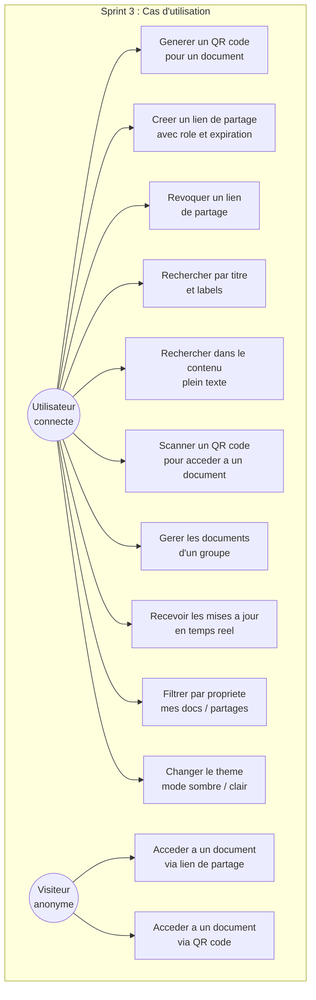
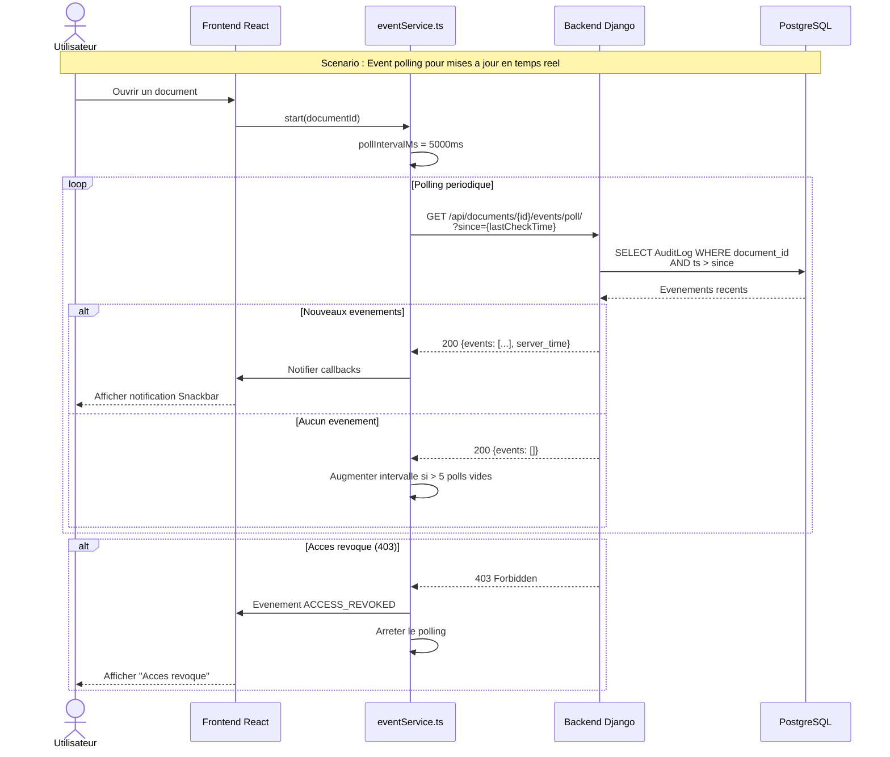
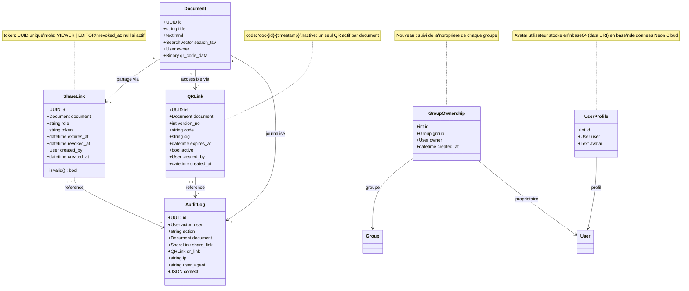

# Chapitre V : Sprint 3 -- Partage Securise et Recherche

## 1. Objectifs du sprint

Le troisieme sprint finalise le systeme de gestion documentaire en ajoutant les fonctionnalites de partage et de recherche :

- Generation de QR codes associes aux documents pour un acces rapide.
- Creation de liens de partage (ShareLink) avec tokens securises et roles configurables.
- Implementation de la recherche standard par titre avec filtrage par labels.
- Implementation de la recherche plein texte (deep search) exploitant les capacites PostgreSQL tsvector.
- Developpement de l'interface de recherche avancee.

## 2. Backlog du sprint

| ID | Tache | Estimation | Statut |
|----|-------|-----------|--------|
| T3.1 | Implementation du generateur de QR codes | 5 | Termine |
| T3.2 | Endpoint de resolution de QR codes | 3 | Termine |
| T3.3 | Modele QRLink et gestion d'expiration | 3 | Termine |
| T3.4 | Modele ShareLink et generation de tokens | 5 | Termine |
| T3.5 | Endpoints de partage par lien | 5 | Termine |
| T3.6 | Recherche standard par titre avec filtrage | 3 | Termine |
| T3.7 | Recherche plein texte avec PostgreSQL tsvector | 8 | Termine |
| T3.8 | Filtrage des resultats par permissions | 5 | Termine |
| T3.9 | Interface de partage et QR codes (frontend) | 5 | Termine |
| T3.10 | Interface de recherche avancee (frontend) | 3 | Termine |
| T3.11 | Event polling pour mises a jour en temps reel | 5 | Termine |
| T3.12 | Page de gestion des documents de groupe | 5 | Termine |
| T3.13 | Modele GroupOwnership et suivi de propriete | 3 | Termine |
| T3.14 | Filtre de propriete et affichage des roles | 3 | Termine |
| T3.15 | Systeme de notifications Snackbar | 3 | Termine |
| T3.16 | Variables CSS et support du mode sombre | 3 | Termine |
| T3.17 | Mise en cache des pages (PageCacheContext) | 3 | Termine |
| T3.18 | Profil utilisateur et avatar | 3 | Termine |
| T3.19 | Tests et validation | 3 | Termine |

## 3. Specification des besoins

### a. Diagrammes de cas d'utilisation

*Figure 17 : Diagramme de cas d'utilisation -- Sprint 3*

**CU -- Creer un lien de partage :**
- *Acteur* : Utilisateur connecte (Proprietaire)
- *Precondition* : L'utilisateur est proprietaire du document
- *Scenario principal* : Le proprietaire selectionne un document, choisit le role a accorder (VIEWER ou EDITOR), et optionnellement definit une date d'expiration. Le systeme genere un token unique et retourne l'URL de partage.
- *Postcondition* : Le ShareLink est cree et l'action est journalisee dans l'audit.

**CU -- Recherche plein texte :**
- *Acteur* : Utilisateur connecte
- *Scenario principal* : L'utilisateur saisit une requete de recherche. Le systeme interroge l'index tsvector de PostgreSQL pour trouver les documents dont le contenu correspond a la requete, filtre les resultats selon les permissions de l'utilisateur, et retourne les documents accessibles.
- *Postcondition* : Les resultats sont affiches, limites aux documents autorises.

### b. Diagrammes de sequences systeme

*Figure 18 : Diagramme de sequence -- Generation de QR code*

*Figure 19 : Diagramme de sequence -- Recherche plein texte*

*Figure 19b : Diagramme de sequence -- Event polling en temps reel*

*Figure 20 : Diagramme de sequence -- Lien de partage*

## 4. Conception

### a. Diagramme de classes

*Figure 21 : Diagramme de classes -- Sprint 3*

### b. Diagrammes de sequences detailles

*Figure 22 : Diagramme de sequence detaille -- Recherche plein texte avec filtrage par permissions*

*Figure 23 : Diagramme de sequence detaille -- Generation et resolution de QR code*

## 5. Realisation

### a. Environnement de travail

En complement des environnements precedents, les technologies suivantes ont ete utilisees :

**Technologies de partage et recherche :**

| Technologie             | Version | Role                                         |
| ----------------------- | ------- | -------------------------------------------- |
| qrcode[pil]             | 7.4.2+  | Generation de QR codes en Python             |
| jsQR                    | 1.4.0   | Lecture de QR codes cote client (JavaScript) |
| PostgreSQL SearchVector | Natif   | Recherche plein texte (tsvector/tsquery)     |

**Technologies d'interface et experience utilisateur :**

| Technologie | Version | Role |
|------------|---------|------|
| CSS Variables (Custom Properties) | CSS3 | Theming dynamique (mode sombre/clair) |
| Snackbar (composant custom) | - | Notifications toast reutilisables |
| PageCacheContext (React Context) | - | Mise en cache SPA avec TTL de 5 minutes |
| Event Polling (eventService.ts) | - | Mises a jour quasi temps reel par polling adaptatif |

**Configuration de la recherche plein texte :**

Le champ `search_tsv` de type `SearchVectorField` est defini sur les modeles `Document` et `DocumentVersion`. Ce champ est indexe et mis a jour automatiquement lors des operations d'ecriture. La configuration linguistique utilisee est `'english'`, permettant la lemmatisation et l'elimination des mots vides.

### b. Interfaces realisees

**Page des documents et QR codes (DocumentsPage.tsx)** : Cette page affiche la liste des documents de l'utilisateur sous forme de cartes. Chaque carte presente le titre du document, les labels associes, la date de creation et un apercu du QR code. L'utilisateur peut telecharger le QR code au format PNG, ouvrir le document dans l'editeur, ou le supprimer.

**Page des liens de partage (ShareLinkPage.tsx)** : Cette interface permet de visualiser et gerer les liens de partage existants pour les documents de l'utilisateur. Pour chaque document, il est possible de creer un nouveau lien avec un role specifique (VIEWER ou EDITOR), de copier le lien dans le presse-papiers et de revoquer un lien existant. La page affiche egalement l'etat de chaque lien (actif, revoque ou expire).

**Interface de recherche** : La recherche est integree a la page des documents. Deux modes sont disponibles :
- **Recherche standard** : Recherche par titre avec possibilite de filtrer par labels. L'endpoint `/api/search/standard/` accepte un parametre `q` pour la requete et `label_ids` pour le filtrage.
- **Recherche approfondie (deep search)** : Recherche dans le contenu complet des documents via l'index tsvector de PostgreSQL. L'endpoint `/api/search/deep/` retourne les documents dont le contenu correspond a la requete, filtres par les permissions de l'utilisateur.

**Page du journal d'audit (AuditLogPage.tsx)** : Cette page affiche l'ensemble des evenements audites pour les documents de l'utilisateur. Chaque entree comprend le type d'action (VIEW, EDIT, SHARE, EXPORT), l'acteur, le document concerne, l'adresse IP, le User-Agent et la date. Les entrees liees a un acces via lien de partage ou QR code sont signalees.

**Page des documents de groupe (GroupDocumentsPage.tsx)** : Cette nouvelle page permet de visualiser et gerer les documents partages au sein d'un groupe. Elle affiche les documents accessibles via les ACL de groupe, avec la possibilite de gerer les permissions d'acces. Le bouton "Gerer l'acces" n'est visible que pour le proprietaire du groupe. La page integre un systeme de mise en cache (PageCacheContext) et un mecanisme d'event polling pour detecter les changements en temps reel.

**Filtre de propriete (DocumentsPage.tsx)** : Un filtre a ete ajoute a la page des documents permettant de basculer entre trois vues : "Tous les documents", "Mes documents" (dont l'utilisateur est proprietaire) et "Partages avec moi" (documents accessibles via ACL). Chaque carte de document affiche desormais un badge de role (OWNER, EDITOR, VIEWER) avec un style visuel distinct par role.

**Systeme de notifications Snackbar** : Un composant reutilisable `Snackbar` a ete developpe pour remplacer les notifications ad-hoc utilisees dans les differentes pages. Ce composant affiche des messages temporaires de type toast avec un style coherent a travers toute l'application. Il est integre dans plus de 8 pages (App, AccessManagement, Auth, Collections, DocumentEditor, Documents, Groups, OCR, VersionHistory).

**Event polling en temps reel (eventService.ts)** : Un service d'event polling a ete implemente pour detecter les changements sur les documents en quasi temps reel. Ce service utilise trois classes specialisees :
- `DocumentEventService` : polling par document avec detection de revocation d'acces.
- `GroupEventService` : polling par groupe pour detecter les ajouts/suppressions de documents.
- `UserGroupsEventService` : polling global pour tous les groupes de l'utilisateur.
Le mecanisme utilise un intervalle adaptatif (5s initialement, jusqu'a 30s en l'absence d'evenements) et se met en pause automatiquement lorsque l'onglet du navigateur n'est pas actif.

**Mode sombre et variables CSS** : L'interface a ete refactorisee pour utiliser des variables CSS pour les couleurs, les arriere-plans, les bordures et les effets de survol. Cela permet de basculer facilement entre le mode clair et le mode sombre via un bouton dans le menu utilisateur. Les pages GroupsPage, OCRPage, SettingsPage, DocumentsPage et plusieurs autres ont ete mises a jour.

**Menu utilisateur et profil (UserMenu.tsx)** : Un nouveau composant de menu utilisateur a ete ajoute, offrant un bouton de bascule pour le mode sombre et la possibilite de telecharger un avatar de profil. Le modele `UserProfile` cote backend stocke l'avatar sous forme de data URI base64 directement en base de donnees, garantissant la persistance dans l'environnement cloud (Azure Container Apps) sans dependance au systeme de fichiers du conteneur.

## 6. Tests et validation

| Test | Description | Resultat |
|------|-------------|----------|
| T1 | Generation d'un QR code pour un nouveau document | Le QR code est genere en PNG (300x300) et associe au document. |
| T2 | Resolution d'un QR code valide | Le document est retourne et l'acces est journalise. |
| T3 | Resolution d'un QR code expire ou inactif | Une erreur 404 est retournee. |
| T4 | Creation d'un lien de partage avec role VIEWER | Le token est genere et le lien est fonctionnel. |
| T5 | Acces via lien de partage revoque | Une erreur 403 est retournee. |
| T6 | Recherche standard par titre | Les documents correspondants sont retournes. |
| T7 | Recherche standard avec filtrage par labels | Seuls les documents portant les labels specifies sont retournes. |
| T8 | Recherche plein texte (deep search) | Les documents dont le contenu correspond sont retournes. |
| T9 | Filtrage des resultats par permissions | Un utilisateur ne voit que les documents auxquels il a acces. |
| T10 | Scan QR code via camera (jsQR) | Le QR code est detecte et le document est affiche. |
| T11 | Event polling avec nouveaux evenements | Les notifications s'affichent en temps reel via Snackbar. |
| T12 | Event polling avec revocation d'acces | L'evenement ACCESS_REVOKED est detecte et le polling s'arrete. |
| T13 | Filtre de propriete "Mes documents" | Seuls les documents dont l'utilisateur est proprietaire s'affichent. |
| T14 | Filtre de propriete "Partages avec moi" | Seuls les documents accessibles via ACL s'affichent. |
| T15 | Page des documents de groupe | Les documents du groupe s'affichent avec les permissions correctes. |
| T16 | Bascule mode sombre / mode clair | Les couleurs de l'interface changent correctement via les variables CSS. |
| T17 | Mise en cache des pages | Les donnees sont restaurees depuis le cache lors du retour sur une page visitee recemment. |

## 7. Revue de sprint

**Livrables du Sprint 3 :**
- Generateur de QR codes avec stockage binaire en base de donnees et endpoint de resolution.
- Modele QRLink avec gestion d'activation et d'expiration.
- Systeme de liens de partage avec tokens uniques et roles configurables.
- Recherche standard par titre avec filtrage multi-labels.
- Recherche plein texte exploitant PostgreSQL tsvector avec fallback.
- Filtrage systematique des resultats par permissions utilisateur.
- Interfaces frontend pour la gestion des QR codes, des liens de partage et de la recherche.
- Service d'event polling avec intervalle adaptatif et detection de revocation d'acces.
- Page de gestion des documents de groupe avec controle d'acces par proprietaire.
- Modele GroupOwnership pour le suivi de la propriete des groupes.
- Filtre de propriete sur la page des documents (mes documents / partages avec moi).
- Affichage des badges de role (OWNER, EDITOR, VIEWER) sur les cartes de documents.
- Composant Snackbar reutilisable integre dans toute l'application.
- Variables CSS et support du mode sombre / mode clair.
- Mise en cache des pages via PageCacheContext (TTL de 5 minutes).
- Profil utilisateur avec avatar stocke en base64 en base de donnees (modele UserProfile).

**Points positifs :**
- Le systeme de QR codes offre un acces rapide et pratique aux documents.
- La recherche plein texte est performante grace a l'index natif PostgreSQL.
- Le filtrage par permissions garantit la confidentialite des donnees.
- L'event polling offre une experience quasi temps reel sans la complexite des WebSockets.
- Le composant Snackbar assure une experience de notification coherente sur toute l'application.
- Les variables CSS facilitent la maintenance du theming et le support du mode sombre.
- La mise en cache des pages ameliore la performance percue lors de la navigation.

**Points d'amelioration :**
- L'ajout de la recherche par expressions regulieres ou par proximite constituerait une evolution utile.
- Le remplacement du polling par des WebSockets (Django Channels) offrirait des mises a jour instantanees avec moins de charge reseau.
- La possibilite de generer des QR codes personnalises (logo, couleurs) serait un plus esthetique.
