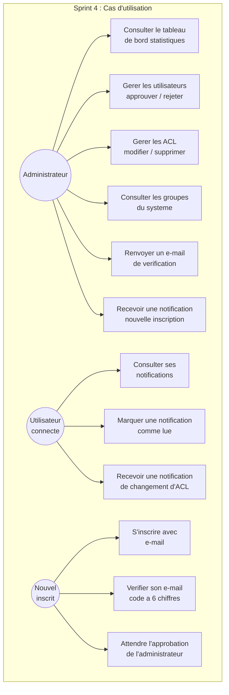
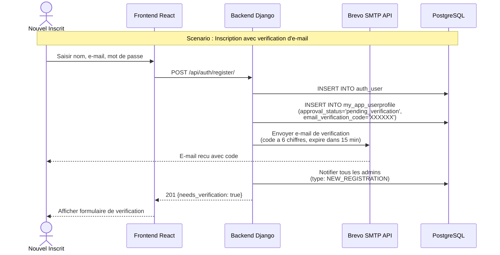
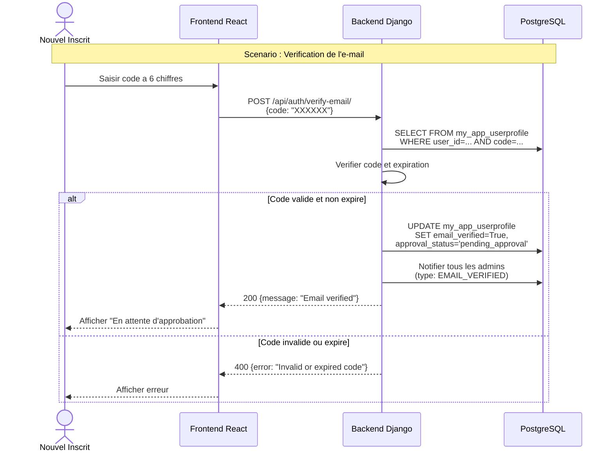
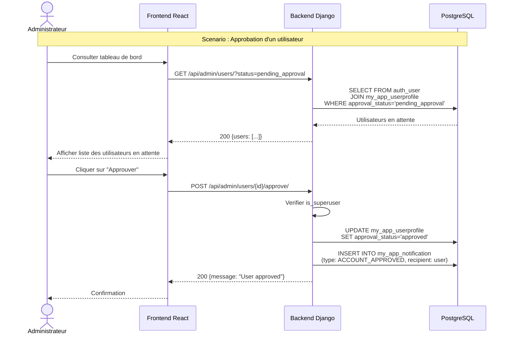
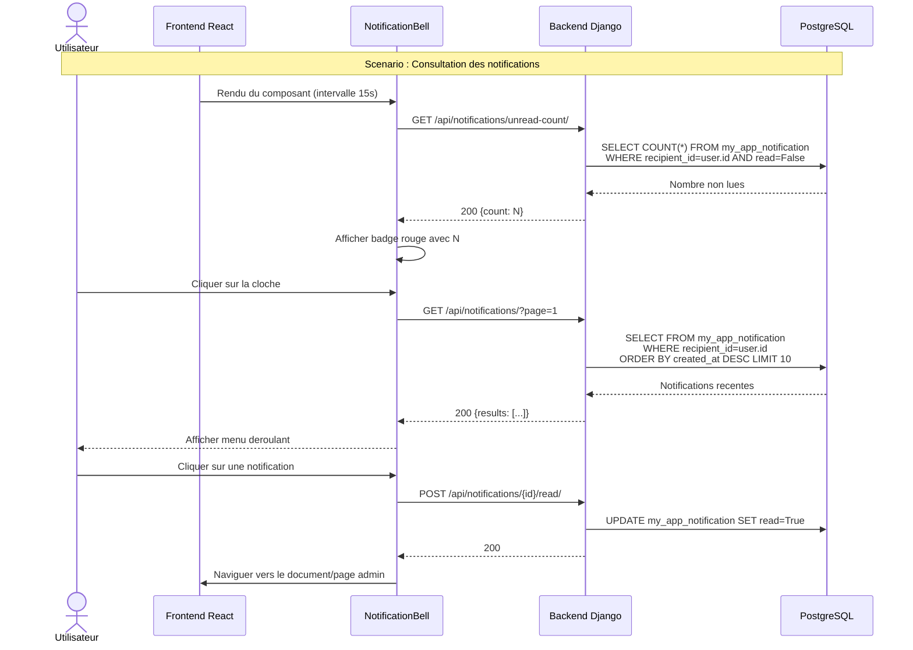
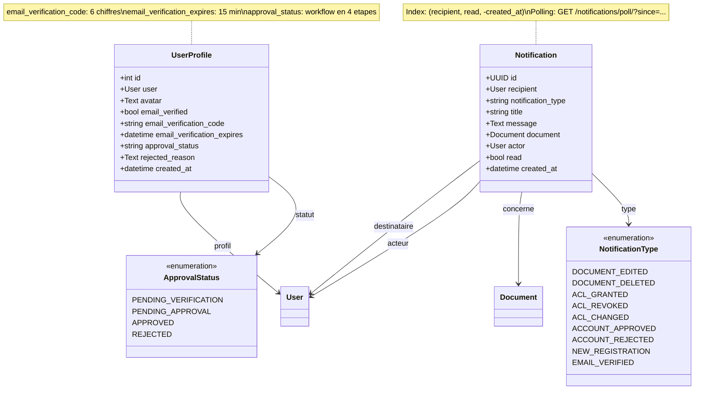
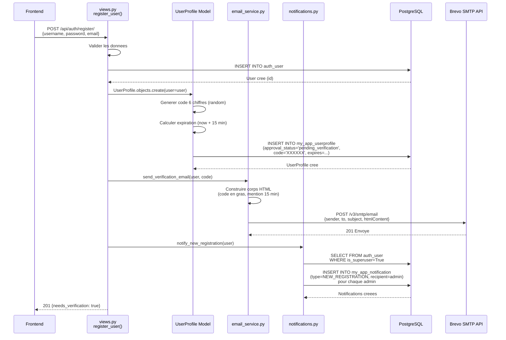
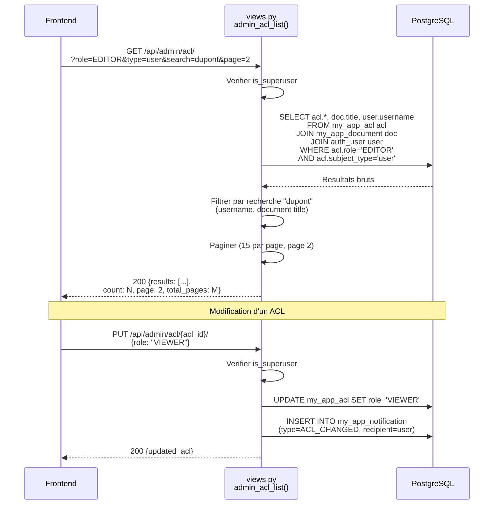
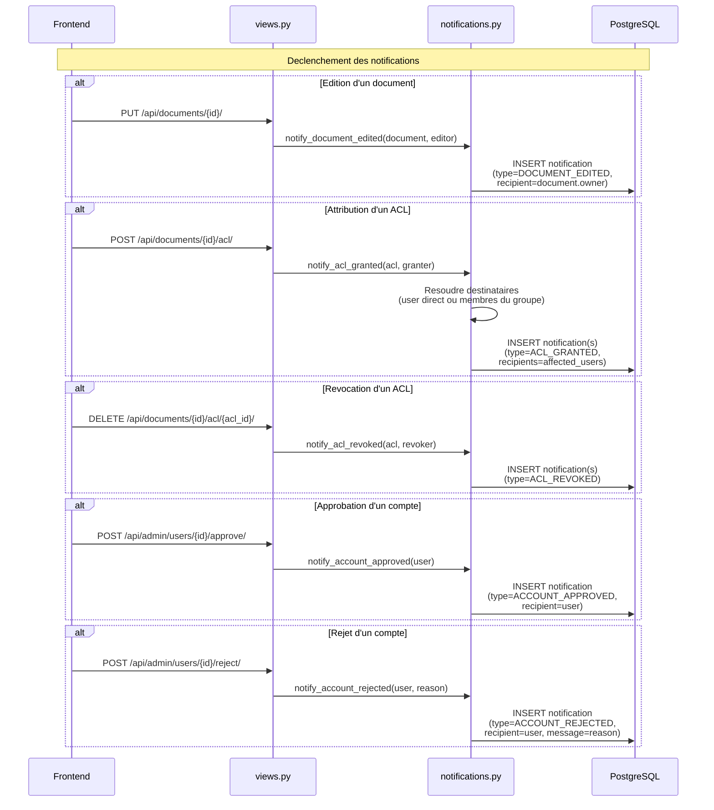

# Chapitre VI : Sprint 4 -- Administration, Notifications et Processus d'Approbation

## 1. Objectifs du sprint

Le quatrieme sprint renforce la gouvernance et la communication au sein du systeme de gestion documentaire. Il couvre les fonctionnalites suivantes :

- Developpement d'un tableau de bord administrateur centralise pour la supervision du systeme.
- Gestion avancee des ACL par l'administrateur avec filtrage, modification et suppression.
- Mise en place d'un processus d'inscription avec verification d'e-mail et approbation par l'administrateur.
- Implementation d'un systeme de notifications en temps reel pour les utilisateurs et les administrateurs.
- Gestion des groupes depuis le tableau de bord administrateur.

## 2. Backlog du sprint

| ID | Tache | Estimation | Statut |
|----|-------|-----------|--------|
| T4.1 | Modele Notification et types de notifications | 5 | Termine |
| T4.2 | Modele UserProfile avec champs de verification et approbation | 5 | Termine |
| T4.3 | Service d'envoi d'e-mails (Brevo SMTP API) | 5 | Termine |
| T4.4 | Endpoints de verification d'e-mail et d'approbation | 8 | Termine |
| T4.5 | Endpoints du tableau de bord administrateur (statistiques, utilisateurs) | 5 | Termine |
| T4.6 | Endpoints de gestion des ACL par l'administrateur | 5 | Termine |
| T4.7 | Endpoints de gestion des groupes par l'administrateur | 3 | Termine |
| T4.8 | Endpoints des notifications (liste, compteur, marquage, polling) | 5 | Termine |
| T4.9 | Utilitaires de declenchement des notifications | 5 | Termine |
| T4.10 | Page du tableau de bord administrateur (frontend) | 8 | Termine |
| T4.11 | Composant NotificationBell et page des notifications | 5 | Termine |
| T4.12 | Integration du processus d'approbation dans la page d'authentification | 5 | Termine |
| T4.13 | Tests et validation | 3 | Termine |

## 3. Specification des besoins

### a. Diagrammes de cas d'utilisation

*Figure 26 : Diagramme de cas d'utilisation -- Sprint 4*

**CU -- Approuver un utilisateur :**
- *Acteur* : Administrateur (superuser)
- *Precondition* : L'utilisateur a verifie son adresse e-mail (statut `pending_approval`)
- *Scenario principal* : L'administrateur consulte la liste des utilisateurs en attente d'approbation dans le tableau de bord. Il selectionne un utilisateur et clique sur "Approuver". Le systeme met a jour le statut et envoie une notification a l'utilisateur.
- *Postcondition* : Le statut de l'utilisateur passe a `approved` et il recoit une notification.

**CU -- Verifier son e-mail :**
- *Acteur* : Nouvel inscrit
- *Precondition* : L'utilisateur a recu un code de verification a 6 chiffres par e-mail
- *Scenario principal* : L'utilisateur saisit le code de verification. Le systeme verifie que le code est correct et n'a pas expire (15 minutes). Le statut passe de `pending_verification` a `pending_approval`. Les administrateurs sont notifies.
- *Postcondition* : L'e-mail est verifie et l'utilisateur attend l'approbation de l'administrateur.

**CU -- Consulter ses notifications :**
- *Acteur* : Utilisateur connecte
- *Scenario principal* : L'utilisateur clique sur l'icone de cloche dans la barre de navigation. Un menu deroulant affiche les 10 dernieres notifications avec un badge indiquant le nombre de notifications non lues. L'utilisateur peut marquer une notification comme lue ou acceder a la page complete des notifications.
- *Postcondition* : Les notifications consultees sont marquees comme lues.

### b. Diagrammes de sequences systeme

*Figure 27 : Diagramme de sequence -- Inscription avec verification d'e-mail*

*Figure 28 : Diagramme de sequence -- Verification de l'e-mail*

*Figure 29 : Diagramme de sequence -- Approbation par l'administrateur*

*Figure 30 : Diagramme de sequence -- Consultation des notifications*

## 4. Conception

### a. Diagramme de classes

*Figure 31 : Diagramme de classes -- Sprint 4*

### b. Diagrammes de sequences detailles

*Figure 32 : Diagramme de sequence detaille -- Inscription complete avec verification*

*Figure 33 : Diagramme de sequence detaille -- Gestion des ACL par l'administrateur*

*Figure 34 : Diagramme de sequence detaille -- Declenchement des notifications*

## 5. Realisation

### a. Environnement de travail

En complement des environnements precedents, les technologies suivantes ont ete utilisees :

**Technologies d'administration et de notifications :**

| Technologie | Version | Role |
|------------|---------|------|
| Brevo (Sendinblue) SMTP API | v3 | Envoi d'e-mails transactionnels (verification) |
| sib-api-v3-sdk | Derniere | SDK Python pour l'API Brevo |

**Nouvelles fonctionnalites backend :**

| Composant | Role |
|-----------|------|
| utils/notifications.py | Module de declenchement des notifications (9 types) |
| utils/email_service.py | Service d'envoi d'e-mails via Brevo SMTP API |
| Modele Notification | Stockage des notifications avec index optimise |
| Modele UserProfile (etendu) | Champs de verification et d'approbation |

**Nouveaux endpoints API :**

| Endpoint | Methode | Role |
|----------|---------|------|
| `/api/auth/verify-email/` | POST | Verification du code e-mail a 6 chiffres |
| `/api/auth/resend-verification/` | POST | Renvoi du code de verification |
| `/api/admin/dashboard/stats/` | GET | Statistiques du tableau de bord |
| `/api/admin/users/` | GET | Liste des utilisateurs avec filtrage par statut |
| `/api/admin/users/{id}/approve/` | POST | Approbation d'un utilisateur |
| `/api/admin/users/{id}/reject/` | POST | Rejet d'un utilisateur avec raison |
| `/api/admin/users/{id}/delete/` | DELETE | Suppression d'un utilisateur |
| `/api/admin/users/{id}/resend-verification/` | POST | Renvoi de l'e-mail de verification par l'admin |
| `/api/admin/acl/` | GET | Liste des ACL avec filtres avances |
| `/api/admin/acl/{id}/` | PUT | Modification du role d'un ACL |
| `/api/admin/acl/{id}/` | DELETE | Suppression d'un ACL |
| `/api/admin/groups/` | GET | Liste de tous les groupes |
| `/api/notifications/` | GET | Liste des notifications paginee |
| `/api/notifications/unread-count/` | GET | Nombre de notifications non lues |
| `/api/notifications/{id}/read/` | POST | Marquer une notification comme lue |
| `/api/notifications/read-all/` | POST | Marquer toutes les notifications comme lues |
| `/api/notifications/poll/` | GET | Polling des nouvelles notifications |

### b. Interfaces realisees

**Tableau de bord administrateur (AdminDashboardPage.tsx)** : Cette page constitue le centre de controle de l'administrateur. Elle comporte quatre onglets :

1. **Onglet Dashboard** : Affiche les statistiques globales du systeme sous forme de cartes (nombre total d'utilisateurs, de documents, d'ACL, de groupes et d'approbations en attente). Il presente egalement un tableau des 10 inscriptions les plus recentes et un journal des 20 dernieres activites du systeme.

2. **Onglet Utilisateurs** : Permet de gerer les comptes utilisateurs. Un filtre par statut (Tous, En attente de verification, En attente d'approbation, Approuve, Rejete) et une barre de recherche par nom ou e-mail facilitent la navigation. Pour chaque utilisateur, l'administrateur peut approuver, rejeter (avec saisie d'une raison dans un dialogue modal), renvoyer l'e-mail de verification ou supprimer le compte.

3. **Onglet ACL** : Offre une vue centralisee de toutes les listes de controle d'acces du systeme. L'administrateur peut filtrer par role (OWNER, EDITOR, VIEWER), par type de sujet (Utilisateur, Groupe), et effectuer une recherche par nom ou titre de document. Les resultats sont pagines (15 par page). Pour chaque ACL, il est possible de modifier le role via un dialogue modal ou de supprimer l'entree.

4. **Onglet Groupes** : Affiche la liste de tous les groupes du systeme avec leur proprietaire et le nombre de membres. Une barre de recherche permet de filtrer par nom de groupe ou nom du proprietaire.

**Composant NotificationBell (NotificationBell.tsx)** : Ce composant s'integre dans la barre de navigation et affiche une icone de cloche avec un badge rouge indiquant le nombre de notifications non lues. Le compteur se met a jour automatiquement toutes les 15 secondes et lors du retour sur l'onglet du navigateur (evenement `visibilitychange`). Au clic, un menu deroulant affiche les 10 notifications les plus recentes avec une icone par type, le titre, et le temps ecoule. Les notifications de type document redirigent vers la page du document, les notifications d'inscription redirigent vers le tableau de bord administrateur. Un bouton "Marquer tout comme lu" et un lien vers la page complete des notifications sont disponibles.

**Page des notifications (NotificationsPage.tsx)** : Cette page affiche l'ensemble des notifications de l'utilisateur avec deux onglets (Toutes / Non lues). Chaque notification affiche un badge de type (Document edite, ACL accorde, Compte approuve, etc.), le titre, le message complet et la date de creation. La pagination est de 20 notifications par page. Un clic sur une notification la marque comme lue et redirige vers la ressource concernee.

**Processus d'approbation dans AuthPage** : La page d'authentification a ete enrichie pour gerer le workflow d'approbation en quatre etapes :
- **Inscription** : Formulaire classique avec nom d'utilisateur, e-mail et mot de passe.
- **Verification de l'e-mail** : Apres inscription, un formulaire de saisie du code a 6 chiffres s'affiche, avec possibilite de renvoyer le code.
- **Attente d'approbation** : Un bandeau informatif indique que le compte est en attente de validation par l'administrateur.
- **Rejet** : Un message affiche la raison du rejet fournie par l'administrateur.

## 6. Tests et validation

| Test | Description | Resultat |
|------|-------------|----------|
| T1 | Inscription et reception du code de verification par e-mail | Le code a 6 chiffres est recu dans la boite de reception. |
| T2 | Verification avec un code valide | Le statut passe a `pending_approval` et les admins sont notifies. |
| T3 | Verification avec un code expire (> 15 min) | Une erreur "code expire" est retournee. |
| T4 | Verification avec un code incorrect | Une erreur "code invalide" est retournee. |
| T5 | Renvoi du code de verification | Un nouveau code est genere et envoye par e-mail. |
| T6 | Approbation d'un utilisateur par l'administrateur | Le statut passe a `approved` et l'utilisateur recoit une notification. |
| T7 | Rejet d'un utilisateur avec raison | Le statut passe a `rejected` et la raison est affichee a l'utilisateur. |
| T8 | Acces au systeme avec un compte non approuve | L'acces est refuse avec un message explicatif. |
| T9 | Affichage des statistiques du tableau de bord | Les compteurs (utilisateurs, documents, ACL, groupes) sont corrects. |
| T10 | Filtrage des utilisateurs par statut | Seuls les utilisateurs du statut selectionne s'affichent. |
| T11 | Modification du role d'un ACL par l'administrateur | Le role est mis a jour et l'utilisateur concerne est notifie. |
| T12 | Suppression d'un ACL par l'administrateur | L'ACL est supprimee et l'utilisateur concerne est notifie. |
| T13 | Filtrage des ACL par role et type de sujet | Les filtres fonctionnent correctement avec pagination. |
| T14 | Reception d'une notification lors de l'attribution d'un ACL | La notification apparait dans le menu deroulant de la cloche. |
| T15 | Reception d'une notification lors de la revocation d'un ACL | La notification informe l'utilisateur de la perte d'acces. |
| T16 | Marquage d'une notification comme lue | Le badge de compteur se met a jour. |
| T17 | Marquage de toutes les notifications comme lues | Le compteur passe a zero. |
| T18 | Polling des notifications (mise a jour automatique du compteur) | Le badge se met a jour toutes les 15 secondes. |
| T19 | Suppression d'un utilisateur par l'administrateur | Le compte est supprime du systeme. |
| T20 | Consultation des groupes dans le tableau de bord | La liste des groupes avec proprietaire et nombre de membres s'affiche. |

## 7. Revue de sprint

**Livrables du Sprint 4 :**
- Processus d'inscription complet avec verification d'e-mail par code a 6 chiffres (Brevo SMTP API) et approbation par l'administrateur.
- Modele UserProfile etendu avec les champs de verification (`email_verified`, `email_verification_code`, `email_verification_expires`) et d'approbation (`approval_status`, `rejected_reason`).
- Tableau de bord administrateur avec quatre onglets : statistiques, gestion des utilisateurs, gestion des ACL et consultation des groupes.
- Gestion avancee des ACL par l'administrateur avec filtrage par role, type de sujet et recherche textuelle, pagination et actions de modification/suppression.
- Systeme de notifications complet avec 9 types de notifications couvrant les operations sur les documents, les ACL et les comptes utilisateurs.
- Composant NotificationBell avec mise a jour automatique du compteur (polling 15s) et menu deroulant.
- Page dediee aux notifications avec onglets Toutes/Non lues et pagination.
- Module utilitaire `notifications.py` centralisant le declenchement des notifications.
- Service d'e-mail `email_service.py` utilisant l'API Brevo pour l'envoi d'e-mails transactionnels.

**Points positifs :**
- Le processus d'approbation en quatre etapes (inscription, verification, approbation, acces) renforce significativement la securite du systeme.
- Le systeme de notifications unifie ameliore la communication entre les utilisateurs et les administrateurs.
- Le tableau de bord centralise offre a l'administrateur une vue complete de l'etat du systeme.
- La gestion des ACL par l'administrateur permet un controle fin des permissions a l'echelle du systeme.
- L'integration de Brevo SMTP API garantit une delivrabilite fiable des e-mails de verification.

**Points d'amelioration :**
- L'ajout de notifications par e-mail (en plus des notifications in-app) pour les evenements critiques enrichirait la communication.
- Le remplacement du polling par des WebSockets pour les notifications offrirait une latence inferieure.
- L'ajout d'un journal d'audit des actions administratives (approbation, rejet, modification d'ACL) completerait la tracabilite.
