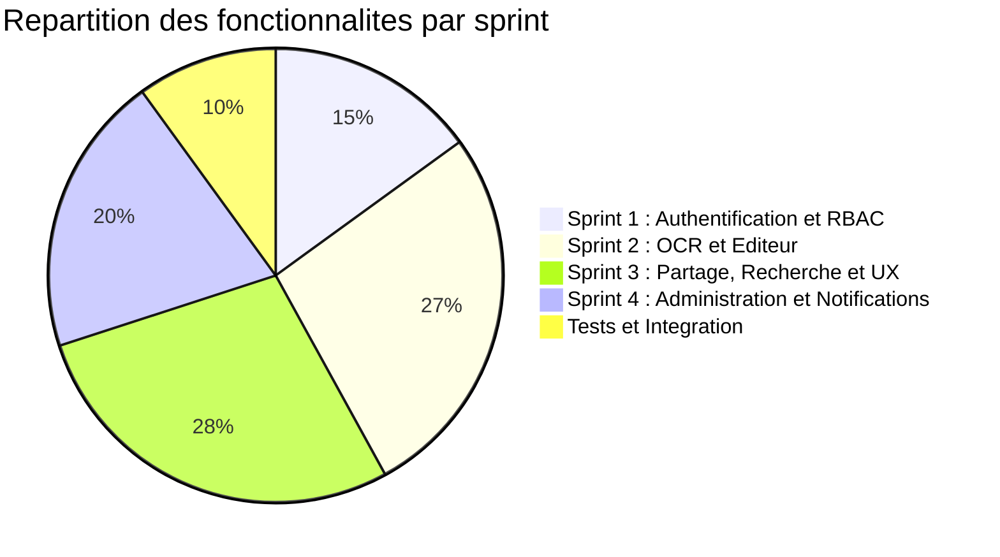
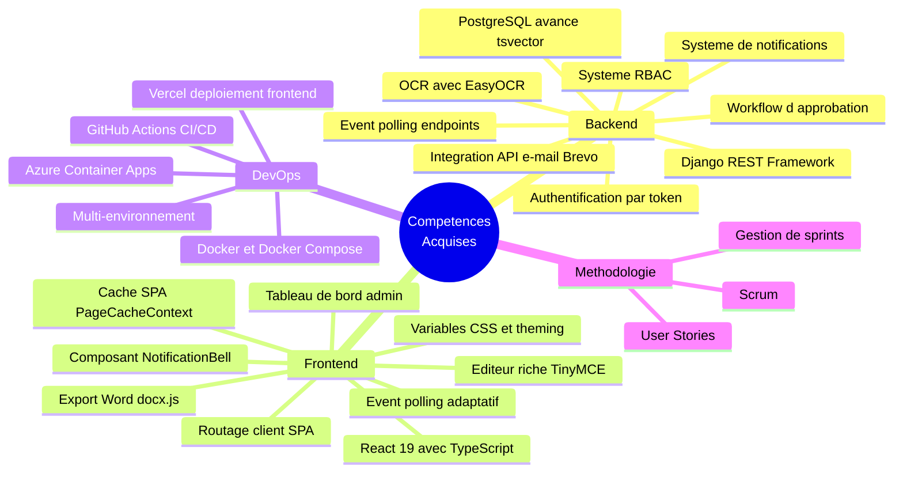

# Chapitre VII : Conclusion Generale

## 1. Bilan du travail realise

Le present projet de stage a abouti a la conception et au developpement d'un systeme de gestion documentaire complet, couvrant l'ensemble du cycle de vie des documents numeriques : digitalisation, edition, organisation, partage, recherche, administration et gouvernance.

Le travail realise au cours des quatre sprints peut etre synthetise comme suit :

*Figure 35 : Repartition de l'effort par sprint*

**Sprint 1** a permis de mettre en place le socle applicatif avec un systeme d'authentification par token, un controle d'acces granulaire par roles (OWNER, EDITOR, VIEWER) supportant les utilisateurs individuels et les groupes, ainsi qu'un journal d'audit complet.

**Sprint 2** a constitue le coeur fonctionnel du systeme avec l'integration d'un pipeline OCR avance (EasyOCR avec preprocessing d'images), le developpement d'un editeur multi-pages de type traitement de texte (TinyMCE), l'export au format Word, le versionnement des documents et l'organisation par labels et collections.

**Sprint 3** a enrichi le systeme avec la generation et la resolution de QR codes, les liens de partage securises avec tokens, la recherche plein texte exploitant les capacites natives de PostgreSQL (tsvector), un service d'event polling pour les mises a jour en temps reel, une page dediee a la gestion des documents de groupe, le support du mode sombre via les variables CSS, et un systeme de notifications Snackbar unifie.

**Sprint 4** a renforce la gouvernance et la communication du systeme avec un tableau de bord administrateur centralise (statistiques, gestion des utilisateurs, controle des ACL, consultation des groupes), un processus d'inscription securise avec verification d'e-mail par code a 6 chiffres (Brevo SMTP API) et approbation par l'administrateur, ainsi qu'un systeme de notifications en temps reel couvrant 9 types d'evenements (operations sur les documents, les ACL et les comptes utilisateurs).

**Bilan technique du projet :**

| Composant | Indicateur |
|-----------|-----------|
| Modeles de donnees | 15 modeles Django (Document, DocumentVersion, Label, Collection, ACL, ShareLink, QRLink, AuditLog, GroupOwnership, UserProfile, Notification, etc.) |
| Endpoints API | 50+ endpoints REST documentes via Swagger |
| Pages frontend | 15+ pages React avec TypeScript |
| Services frontend | documentService.ts, ocrService.ts, eventService.ts (~1 500 lignes) |
| Lignes de code backend (views.py) | ~3 300 lignes |
| Composants reutilisables | Snackbar, UserMenu, NotificationBell, WordLikeEditor, Autocomplete |
| Systeme de cache | PageCacheContext avec TTL de 5 minutes (5 pages cachees) |
| Types de notifications | 9 types (document, ACL, compte) avec polling automatique |
| Technologies integrees | Django 5.2, React 19, EasyOCR, TinyMCE, PostgreSQL, Brevo SMTP, Docker, Azure Container Apps, Vercel |

## 2. Difficultes rencontrees

Au cours du developpement, plusieurs difficultes techniques ont ete rencontrees :

- **Integration d'EasyOCR** : La mise en place du moteur OCR a necessite un travail approfondi sur le preprocessing des images. La qualite de l'extraction depend fortement de la resolution et du contraste de l'image source. L'application de techniques comme l'egalisation adaptative d'histogramme (CLAHE) et le flou gaussien a permis d'ameliorer significativement les resultats.

- **Editeur multi-pages** : Le developpement du composant WordLikeEditor a represente un defi technique considerable. La gestion du reflow du contenu entre les pages, la preservation de la position du curseur lors des manipulations du DOM, et le debounce des operations de redistribution ont necessite une logique complexe.

- **Recherche plein texte** : La configuration de l'index tsvector de PostgreSQL et la gestion du fallback pour les environnements sans support natif ont demande une comprehension approfondie des mecanismes de recherche de PostgreSQL.

- **Configuration Docker et deploiement cloud** : La conteneurisation avec Docker et Docker Compose pour le developpement local, puis le deploiement sur Azure Container Apps (backend) et Vercel (frontend) ont necessite plusieurs iterations. La configuration du pipeline CI/CD via GitHub Actions, la gestion des secrets (tokens Azure, variables d'environnement) et la mise en place du CORS entre le frontend Vercel et le backend Azure ont represente des defis techniques notables.

- **Connexion a la base de donnees** : L'utilisation de Neon PostgreSQL (cloud) a necessite l'optimisation des parametres de connexion pour reduire la latence et gerer correctement les variables d'environnement via python-dotenv.

- **Event polling et reactivite** : La mise en place d'un mecanisme de polling adaptatif a necessite de trouver un equilibre entre reactivite (detection rapide des changements) et performance (reduction de la charge reseau). L'implementation d'un intervalle adaptatif (5s a 30s) et la pause automatique lors du changement d'onglet ont permis d'optimiser ce compromis.

- **Integration du service d'e-mail** : La configuration de l'API Brevo (Sendinblue) pour l'envoi d'e-mails transactionnels a necessite la gestion des cles API, la construction du corps HTML des e-mails et la mise en place d'un mecanisme de code a usage unique avec expiration. La delivrabilite des e-mails et la gestion des erreurs (adresse invalide, quota depasse) ont demande une attention particuliere.

- **Workflow d'approbation multi-etapes** : La conception d'un processus d'inscription en quatre etapes (inscription, verification d'e-mail, approbation administrateur, acces) a implique la gestion de multiples etats dans le modele UserProfile et la synchronisation entre le frontend et le backend pour afficher l'interface appropriee a chaque etape.

## 3. Competences acquises

Ce stage a permis l'acquisition et le renforcement de nombreuses competences techniques et methodologiques :

**Competences techniques :**

*Figure 36 : Cartographie des competences acquises*

- **Developpement backend** : Maitrise de Django REST Framework pour la construction d'API RESTful, implementation d'un systeme d'authentification par token, conception d'un systeme RBAC, integration de la recherche plein texte PostgreSQL, developpement d'un systeme de notifications avec 9 types d'evenements, integration de l'API Brevo pour l'envoi d'e-mails transactionnels, et conception d'un workflow d'approbation multi-etapes.

- **Developpement frontend** : Utilisation avancee de React 19 avec TypeScript, gestion d'etat et de routage avec React Router DOM, integration d'editeur riche (TinyMCE), manipulation du DOM pour le reflow multi-pages, implementation d'un systeme de cache SPA (PageCacheContext), service d'event polling avec intervalle adaptatif, theming dynamique via les variables CSS, developpement d'un tableau de bord administrateur multi-onglets et d'un composant de notifications en temps reel.

- **Traitement d'images et OCR** : Comprehension des techniques de preprocessing d'images (CLAHE, flou gaussien, redimensionnement), utilisation d'EasyOCR pour l'extraction de texte avec detection de positions.

- **Conteneurisation et deploiement cloud** : Maitrise de Docker et Docker Compose pour le developpement local. Deploiement du backend sur Azure Container Apps (via GitHub Container Registry et GitHub Actions) et du frontend sur Vercel. Configuration des pipelines CI/CD pour le deploiement automatique, gestion des variables d'environnement et des secrets dans les environnements cloud.

- **Methodologie Scrum** : Pratique du decoupage en sprints, redaction de user stories, gestion du product backlog et revues de sprint.

## 4. Perspectives d'amelioration

Plusieurs pistes d'amelioration et d'evolution ont ete identifiees pour enrichir le systeme :

- **Edition collaborative en temps reel** : L'integration de WebSockets (via Django Channels) permettrait a plusieurs utilisateurs de modifier simultanement un document, avec resolution des conflits et synchronisation en temps reel.

- **Support multilangue de l'OCR** : L'ajout de la reconnaissance pour l'arabe et le francais, langues couramment utilisees en Tunisie, elargirait le champ d'application du systeme.

- **Notifications par e-mail** : En complement des notifications in-app deja implementees, l'envoi d'e-mails pour les evenements critiques (revocation d'acces, modification importante) ameliorerait la reactivite des utilisateurs absents de la plateforme.

- **Application mobile** : Le developpement d'une application mobile (React Native) avec acces camera pour la numerisation et la lecture de QR codes offrirait une experience utilisateur complementaire.

- **Intelligence artificielle** : L'integration de modeles de traitement du langage naturel pour le resume automatique, la classification et l'extraction d'entites a partir des documents constituerait une evolution a forte valeur ajoutee.

- **Statistiques avancees** : L'enrichissement du tableau de bord administrateur avec des visualisations graphiques (evolution du nombre de documents, activite par utilisateur, documents les plus consultes) fournirait des indicateurs de pilotage plus detailles.

- **Signature electronique** : L'integration d'un mecanisme de signature numerique renforcerait la valeur juridique des documents geres par le systeme.

- **WebSockets pour les notifications** : Le remplacement du mecanisme de polling par des WebSockets (Django Channels) pour le systeme de notifications reduirait la latence et la charge reseau.

---

*Le present projet de stage a permis de developper un systeme de gestion documentaire fonctionnel et complet, repondant aux objectifs fixes. L'adoption de la methodologie Scrum a structure le travail en quatre sprints coherents, chacun aboutissant a un ensemble de fonctionnalites operationnelles. Le quatrieme sprint a particulierement renforce la gouvernance du systeme avec un processus d'approbation securise, un systeme de notifications et un tableau de bord administrateur centralise. Les technologies modernes utilisees (Django, React, PostgreSQL, EasyOCR, Brevo, Docker) et l'infrastructure de deploiement cloud (Azure Container Apps, Vercel, Neon, GitHub Actions) constituent une base solide pour les evolutions futures du systeme.*
